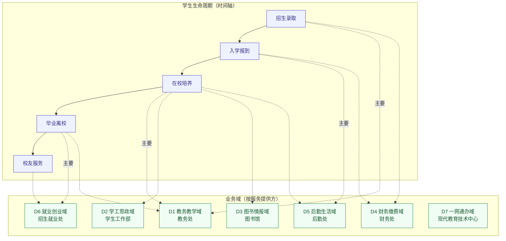
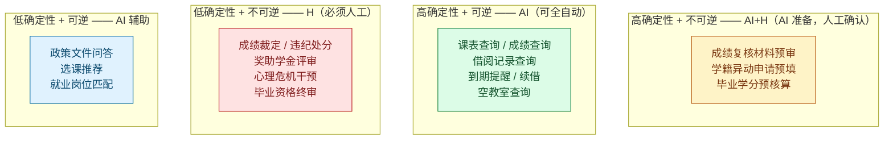
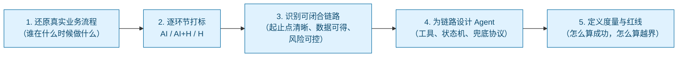

# 00 行业总览：校园业务全景与 AI 落地地图

> 本文回答三个问题：高校的业务到底是怎么运转的？哪些环节适合 AI？我们应该按什么顺序做？

---

## 1. 行业现状：烟囱式建设与"最后一公里"断裂

### 1.1 系统的真实分布

一所普通本科院校（在校生 2 万人规模）通常同时在跑下列系统：

| 业务系统 | 主管部门（甲方） | 承载业务 | 典型厂商/形态 |
|---|---|---|---|
| 教务管理系统 | 教务处 | 排课、选课、成绩、学籍、考试 | 正方 / 强智 / 超星 |
| 图书馆集成系统（ILS） | 图书馆 | 借阅、编目、预约、座位 | 汇文 / 图创 Interlib |
| 一卡通系统 | 后勤处 / 财务处 | 消费、门禁、水电、考勤 | 新开普 / 正元 |
| 学工管理系统 | 学生工作部 | 奖助贷、请假、宿舍、思政 | 自研或外包 |
| 财务缴费平台 | 财务处 | 学费、住宿费、报销 | 用友 / 银行合作 |
| 就业管理系统 | 招生就业处 | 宣讲、招聘、三方、派遣 | 省级平台 + 校级 |
| 统一身份认证（SSO） | 现代教育技术中心 | 账号与权限 | CAS / OAuth2 |
| 网上办事大厅 | 现代教育技术中心 | 一网通办入口 | 集成门户 |

**核心矛盾：系统按"管理部门"切分，而学生按"我需要办一件事"使用。** 两个视角的错位，就是所有痛点的源头。

### 1.2 四类典型痛点（Agent 的机会点）

| 痛点 | 具体表现 | 本质 | Agent 机会 |
|---|---|---|---|
| **入口分散** | 查课表开 A 系统、查借阅开 B 公众号、查成绩等 C 系统 | 没有统一交互层 | 统一自然语言入口，一次身份核验穿透多系统 |
| **信息被动** | 补考通知、借阅逾期、选课开放时间散落各系统，靠学生自己盯 | 通知是"拉"模式，不是"推"模式 | 事件驱动 + 订阅式主动提醒 |
| **流程黑箱** | 学生不知道一件事要几步、找谁、带什么材料、当前到哪了 | 流程未对学生透明化 | 流程解释 + 材料清单校验 + 进度跟踪 |
| **规则复杂** | 能不能续借、够不够补考资格、满没满足毕业学分，规则藏在文件里 | 规则未转化为可执行逻辑 | 规则引擎前置判断，只提示不下结论 |

### 1.3 为什么"不能全自动"——校园业务的三个特殊性

1. **结论具有法律与档案效力。** 成绩、学籍、毕业资格写入学生档案，终身可查。判错不是"体验问题"，是**教学事故**。
2. **大量业务依赖主观判断与集体决策。** 成绩复核的裁定、奖助学金的评定、心理危机的干预，本质是人的判断，AI 无法替代也不应替代。
3. **数据高度敏感。** 成绩、家庭经济情况、心理记录、处分记录，属于《个人信息保护法》下的敏感个人信息，且存在**师生权限不对等**（辅导员能看全班，学生只能看自己）。

**结论：校园智能体的正确定位是"信息层与服务前置层"的自动化，而不是"决策层"的自动化。**

---

## 2. 业务域拆分

按"服务提供方 + 学生生命周期"两个维度，把校园业务拆成 **7 个业务域**：

### 2.1 七域职责一览

| 域 | 核心业务对象 | 关键流程 | 风险等级 | AI 适配度 |
|---|---|---|---|---|
| **D1 教务教学** | 课程、成绩、考试、学籍 | 选课、成绩发布、考试安排、调停课、学籍异动、毕业审核 | **极高** | 查询高 / 变更低 |
| **D2 学工思政** | 学生、奖助、宿舍、心理 | 奖助学金评定、请假、宿舍分配、心理筛查、第二课堂学分 | **极高** | 中低 |
| **D3 图书情报** | 书目、借阅记录、座位 | 借阅、续借、预约、赔书、座位与研讨间预约 | 低 | **极高** |
| **D4 财务缴费** | 应缴费用、消费流水 | 学费缴纳、一卡通充值、报销 | 高 | 中 |
| **D5 后勤生活** | 宿舍、报修单、门禁 | 迎新报到、报修、水电、门禁、班车 | 中 | 中高 |
| **D6 就业创业** | 宣讲会、岗位、三方协议 | 宣讲报名、简历投递、协议书签订、档案派遣 | 高 | 中 |
| **D7 一网通办** | 身份、流程实例、消息 | 统一认证、流程审批、消息推送 | 高（底座） | 高（底座） |

> **D7 是底座而非业务**：它不产生业务价值，但没有它，前六域的数据无法被打通。Agent 的接入必须依赖 D7 的统一身份认证与消息通道。

---

## 3. AI 适配度评估模型

不要凭直觉判断"能不能用 AI"。用一个二维模型量化：

**维度 A：信息确定性** —— 结果是否可从权威数据源直接、无歧义地获得？
**维度 B：后果可逆性** —— 出错了能否低成本补救？

**得到的落地顺序是显然的：Q2 象限先做（阶段一），Q1 象限跟上（阶段二），Q3 象限只做"转人工"，Q4 象限做辅助但不做承诺。**

---

## 4. 分阶段落地路线图

| 阶段 | 主题 | 覆盖能力 | 关键指标 | 依赖 |
|---|---|---|---|---|
| **阶段一** （本文档重点） | **校园助手 Agent** | 课表查询、成绩查询、图书借阅信息查询、**自动提醒** | 查询准确率 ≥99.5%、提醒触达率 ≥95%、转人工率 ≤8% | SSO、教务只读接口、ILS 只读接口、消息通道 |
| 阶段二 | 办事向导 Agent | 办事流程问答、材料清单校验、表单预填、进度查询 | 一次性办结率提升、窗口咨询量下降 30% | 办事大厅流程数据、事项知识库 |
| 阶段三 | 学业规划 Agent | 学分缺口分析、选课推荐、毕业预警 | 预警提前量、学业帮扶覆盖率 | 人培方案结构化、历史成绩数据 |
| 阶段四 | 主动服务 Agent | 全量事件驱动推送、个性化服务编排 | 学生主动查询量下降、满意度 | 全量数据中台、学生画像 |

**为什么阶段一只做"查询 + 提醒"？** 因为它同时满足四个条件：**高频**（每人每月多次）、**低风险**（只读、可逆）、**规则明确**（无需主观判断）、**数据可得**（教务与 ILS 均有稳定的只读通道）。这四点决定了它能最快产生可衡量的价值，同时不触碰任何制度红线。

---

## 5. 人工兜底总原则（红线清单）

以下为**全校通行的不可逾越红线**，各业务域文档与阶段一设计文档均须遵守：

| 编号 | 红线 | 说明 |
|---|---|---|
| **R1** | **不做终局性结论** | 凡涉及学籍状态、成绩认定、毕业资格、处分定性的结论，Agent 只能说"以 X 部门答复为准"，禁止输出判定性表述 |
| **R2** | **不做不可逆写操作** | 除明确列入白名单的低风险写操作（如图书续借）外，Agent 不直接写业务系统 |
| **R3** | **不做敏感数据的二次加工** | 成绩、心理、家庭经济信息不进入模型长期记忆、不参与训练、不跨用户聚合展示 |
| **R4** | **不替学生表达诉求** | Agent 不代替学生提交申诉、复议、举报等主张性材料，只能辅助准备 |
| **R5** | **生命优先** | 涉及心理危机、人身安全的关键词，**跳过所有常规流程**，直接推送校内 24 小时求助通道与辅导员联系方式 |
| **R6** | **不确定即转人工** | 置信度低于阈值、数据源冲突、连续两轮未解决问题，一律转人工，禁止"猜一个答案" |

---

## 6. 本设计的方法论

贯穿全套文档的一条分析主线：

- 第 1 步见文档 **01 / 02 / 03**
- 第 2 步的完整矩阵见文档 **11**
- 第 3、4 步见文档 **10 / 12**
- 第 5 步见文档 **13**

---

**下一篇** → [01 业务域：教务与学工](./01-业务域-教务与学工.md)
