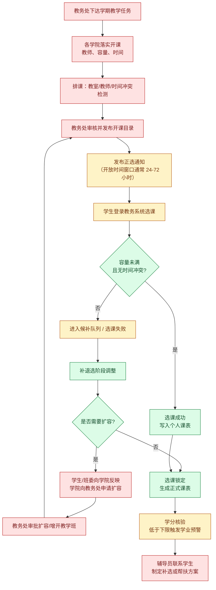
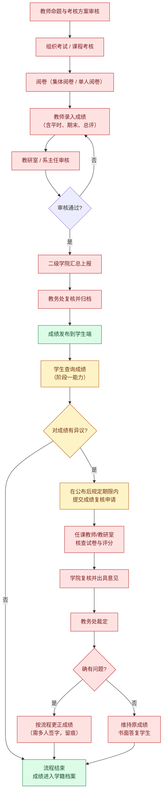
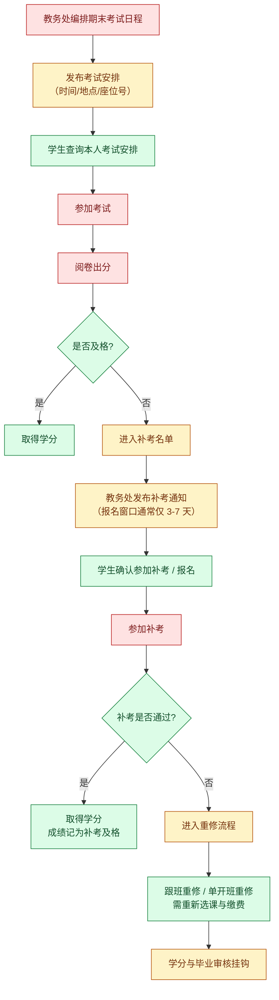
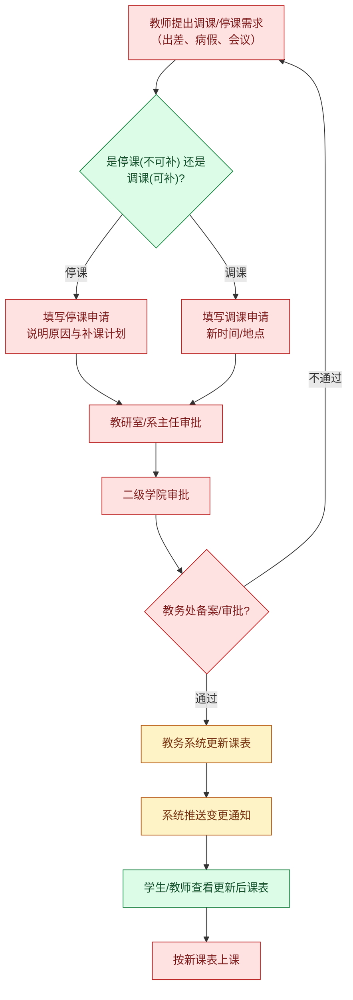
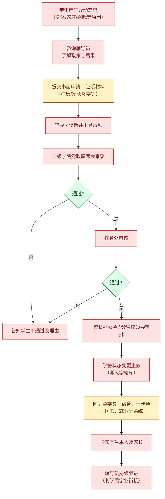
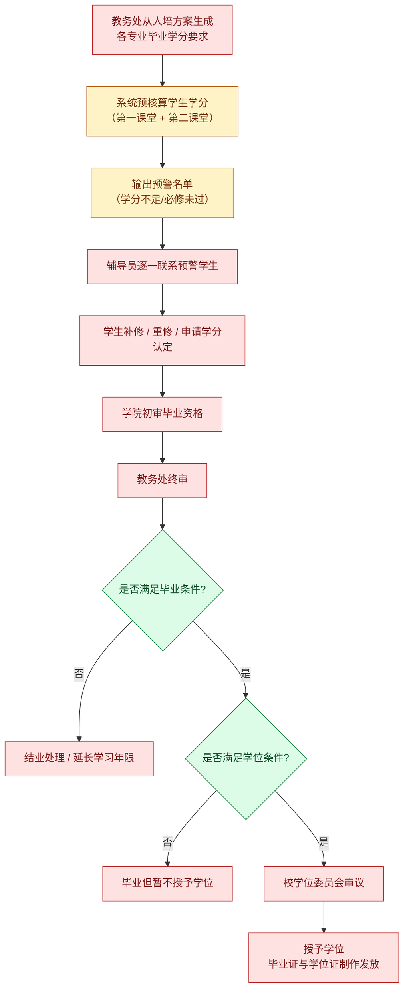
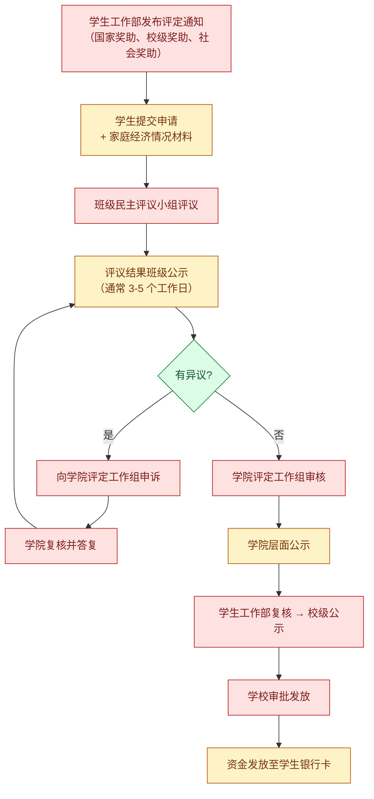

# 01 业务域：教务与学工（D1 / D2）

> 校园业务中**权重最大、风险最高**的两个域。教务管"学"，学工管"人"。本文还原其真实流程并逐环节标注 AI 边界。

---

## 1. 域内角色与系统

| 角色 | 职责 | 使用系统 |
|---|---|---|
| 学生 | 选课、查成绩、报名考试、申请异动 | 教务系统学生端、办事大厅 |
| 任课教师 | 成绩录入、调停课申请 | 教务系统教师端 |
| 教研室/系主任 | 教学任务审核、试卷审核、成绩复核初审 | 教务系统 |
| 二级学院教务办 | 教学任务落实、异动初审、毕业资格初审 | 教务系统 |
| 教务处 | 排课、成绩发布、异动终审、毕业终审、规则制定 | 教务系统管理端 |
| 辅导员/班主任 | 学业预警、请假、奖助评定、思政 | 学工系统 |
| 学生工作部 | 奖助贷政策、宿舍、心理 | 学工系统管理端 |

> ⚠️ **关键行业特征：二级管理。** 涉及学生的绝大多数审批，都是"学院初审 → 教务处终审"的两级结构。这意味着任何流程都不可能被单一系统自动闭合，**人的审批环节是制度要求，不是效率缺陷**。

---

## 2. 流程一：选课（正选 / 补退选）

这是学生感知最强、也最容易出事故的流程（抢课导致系统崩溃、学分不足影响毕业）。

### 逐环节边界拆解

| 步骤 | 环节 | 标注 | 理由 | Agent 能做/不能做 |
|---|---|---|---|---|
| S1 | 下达教学任务 | **H** | 教学计划，制度性决策 | — |
| S2 | 学院落实开课 | **H** | 师资安排，人的决策 | — |
| S3 | 排课与冲突检测 | **H** | 算法可辅助，但最终由教务确认 | 可辅助输出"冲突提示"，不排 | 
| S4 | 审核发布目录 | **H** | 签章生效 | — |
| S5 | 发布选课通知 | **AI+H** | 通知内容由教务定，投放可自动 | ✅ 可自动多渠道投放、定时提醒 | 
| S6 | 学生选课 | **AI+H** | 写操作，涉及个人学分 | ✅ 可做"开课目录查询 + 时间冲突预检"；❌ 不代学生提交选课 |
| S7 | 容量冲突判定 | **AI** | 纯规则 | ✅ 可提前模拟"能否选上"，提示备选 |
| S8 | 选课成功写课表 | **AI** | 系统自动 | ✅ Agent 可读取并生成个人课表 |
| S9 | 候补/失败 | **AI** | 规则明确 | ✅ 可解释失败原因、推荐替代课程 |
| S10 | 补退选调整 | **AI+H** | 同 S6 | ✅ 查询窗口期与剩余容量；❌ 不代提交 |
| S11-S13 | 扩容申请与审批 | **AI+H** | 学生诉求表达 + 教务决策 | ✅ 可生成扩容量申请说明与去重簇证据；❌ 不代提交、不施加影响 |
| S14 | 选课锁定生成课表 | **AI** | 系统自动 | ✅ **课表查询**（阶段一核心能力） |
| S15 | 学分核验与预警 | **AI** | 规则明确 | ✅ 可计算学分缺口、提前预警 |
| S16 | 辅导员帮扶 | **H** | 思政工作，人际干预 | ✅ 仅推送预警线索给辅导员；❌ 不代辅导员沟通 |

> **对阶段一的意义：** 选课辅助不是阶段一目标，但 **S14 生成的课表是阶段一"课表查询 + 上课提醒"的数据源**。

---

## 3. 流程二：成绩发布与成绩复核（最敏感）

### 逐环节边界拆解

| 步骤 | 环节 | 标注 | 理由 | Agent 能做/不能做 |
|---|---|---|---|---|
| T1-T8 | 命题到归档 | **H** | 全链条人的判断 + 签字责任 | ❌ 完全不介入（数据未发布即为教学机密） |
| T9 | 成绩发布 | **AI** | 事件触发 | ✅ 可监听发布事件，触发推送 |
| T10 | 学生查询成绩 | **AI** | 只读、本人数据 | ✅ **成绩查询**（阶段一核心能力） |
| T11 | 是否有异议 | **AI+H** | 学生主观诉求 | ✅ 可解释复核政策、时限、材料清单 |
| T13 | 提交复核申请 | **AI+H** | 主张性材料 | ✅ 可预填表单、校验材料完整度、提示截止时间；❌ 不代为提交（红线 R4） |
| T14 | 教师核查 | **H** | 专业判断 | ❌ |
| T15 | 学院复核 | **H** | 集体判断 | ❌ |
| T16 | 教务处裁定 | **H** | 终局性结论 | ❌ **必须转人工**（红线 R1） |
| T17 | 是否更正 | **H** | 终局性结论 | ❌ |
| T18 | 成绩更正 | **H** | 写档案，不可逆 | ❌ |
| T19 | 答复学生 | **H** | 主张性答复 | ❌ 只提供进度查询 |

> **红线落地要点（对应 R1/R3/R4）：**
> - Agent 遇到"我这门课是不是挂了/会不会影响毕业"这类问题，**只能复述成绩数值与学校既定规则原文，不得输出"你已挂科""你无法毕业"等判定**。
> - 成绩数据不进入长期记忆，不生成画像标签（如"学业困难学生"）——该标签若产生，须由辅导员依据制度认定。

---

## 4. 流程三：考试安排与补考重修

### 逐环节边界拆解

| 步骤 | 环节 | 标注 | Agent 能做/不能做 |
|---|---|---|---|
| E1 | 编排考试日程 | **H** | — |
| E2 | 发布考试安排 | **AI+H** | ✅ 发布后自动推送至订阅学生（含考前 3 天 / 1 天 / 2 小时三级提醒） |
| E3 | 查询考试安排 | **AI** | ✅ 可查（阶段一延伸能力） |
| E4 | 参加考试 | **H** | — |
| E5 | 阅卷出分 | **H** | — |
| E6 | 及格判定 | **AI** | ✅ 可基于成绩数值判断，但**结论性表述必须引述教务系统原始状态字段**，不得由 Agent 自行计算得出"挂科"结论 |
| E7/E13 | 取得学分 | **AI** | ✅ 只读展示 |
| E8 | 进入补考名单 | **AI** | ✅ **可主动提醒**——这是"信息被动"痛点最典型的解法：学生不用自己去官网翻通知 |
| E9 | 发布补考通知 | **AI+H** | ✅ 通知内容由教务定，Agent 负责精准触达 + 倒计时提醒 |
| E10 | 补考报名确认 | **AI+H** | ✅ 可预填、可提醒截止时间；❌ 不代提交 |
| E11 | 参加补考 | **H** | — |
| E12 | 通过判定 | **AI** | 同 E6 |
| E14/E15 | 重修流程 | **AI+H** | ✅ 可解释重修规则、计算重修对毕业时间的影响；❌ 不代选课缴费 |
| E16 | 学分与毕业挂钩 | **H** | ❌ **红线 R1**：毕业资格只能由教务处认定 |

> **阶段一直接受益点：** 补考提醒是"提醒引擎"的高价值场景——**错过报名窗口是不可逆损失，而提醒本身零风险**。

---

## 5. 流程四：调停课

| 步骤 | 环节 | 标注 | Agent 能做/不能做 |
|---|---|---|---|
| M1-M7 | 申请与审批全链路 | **H** | ❌ 制度性流程，涉及教学秩序 |
| M8 | 课表更新 | **AI+H** | ✅ 变更**生效后**自动同步到 Agent 课表视图 |
| M9 | 推送变更通知 | **AI+H** | ✅ **高价值**：调停课临时变更学生极易漏看，Agent 可即时推送「哪门课、何时、改到哪」 |
| M10 | 查看新课表 | **AI** | ✅ 课表查询（阶段一核心能力） |
| M11 | 按新课表上课 | **H** | ✅ 可生成上课前提醒 |

---

## 6. 流程五：学籍异动（休学 / 复学 / 转专业）

| 步骤 | 环节 | 标注 | Agent 能做/不能做 |
|---|---|---|---|
| X1-X2 | 需求产生与咨询 | **AI+H** | ✅ 可解释政策原文、列出材料清单、说明各方案后果（**中立陈述，不推荐**）；❌ 不做"你应该休学"这类建议 |
| X3 | 提交申请与材料 | **AI+H** | ✅ 材料清单校验（缺哪份一眼可见）；❌ 不代提交（红线 R4） |
| X4-X10 | 审议与审批 | **H** | ❌ 完全禁止介入 |
| X11 | 学籍变更生效 | **H** | ❌ 不可逆，红线 R1 |
| X12 | 跨系统同步 | **AI+H** | ✅ 可提示学生"一卡通/宿舍/借阅权限将同步变更，注意处理在借图书" |
| X13-X14 | 通知与跟进 | **H** | ✅ 仅可推送进度状态 |

---

## 7. 流程六：毕业资格审核

| 步骤 | 环节 | 标注 | Agent 能做/不能做 |
|---|---|---|---|
| G1 | 生成学分要求 | **H** | — |
| G2 | 预核算学分 | **AI+H** | ✅ 可**只读计算**学分缺口并展示明细（"你还差 X 学分，分别是..."），但必须标注"预核算结果，最终以教务处认定为准" |
| G3 | 输出预警名单 | **AI+H** | ⚠️ 名单涉敏感标签，**仅对辅导员可见，不对学生群体公开**（红线 R3） |
| G4 | 辅导员联系 | **H** | — |
| G5 | 补修与学分认定 | **AI+H** | ✅ 可解释认定规则；❌ 不代提交 |
| G6-G7 | 初审终审 | **H** | ❌ **红线 R1** |
| G8/G10 | 资格判定 | **H** | ❌ 禁止 Agent 输出"你能毕业/不能毕业" |
| G9-G13 | 结论与授位 | **H** | ❌ |

---

## 8. 流程七：奖助学金评定（学工域）

| 步骤 | 环节 | 标注 | Agent 能做/不能做 |
|---|---|---|---|
| P1 | 发布通知 | **AI+H** | ✅ 可精准推送 + 截止时间提醒（**该提醒性价比极高**：错过无法补） |
| P2 | 学生申请 | **AI+H** | ✅ 材料清单与填写指引；❌ 不代提交（红线 R4） |
| P3 | 民主评议 | **H** | ❌ 涉隐私与主观评价，绝对禁止 AI 参与 |
| P4/P9 | 公示 | **AI+H** | ⚠️ **红线 R3**：公示内容不得含家庭经济细节、身份证号、银行卡号；Agent 不生成公示文本 |
| P5-P7 | 异议与救济 | **H** | ❌ 主张性诉求 |
| P8/P10/P11 | 审核审批 | **H** | ❌ |
| P12 | 发放 | **AI+H** | ✅ 可提醒"款项将于 X 日到账"，金额敏感字段脱敏 |

---

## 9. 本域边界汇总

| 类别 | 环节 | 通用准则 |
|---|---|---|
| ✅ **AI 可全自动** | 课表查询、成绩查询、考试安排查询、学分缺口预核算、补考/选课/奖助截止提醒、调停课变更推送、进度查询 | 只读 + 规则明确 + 结果可逆 |
| 🟡 **AI 准备 + 人工确认** | 复核申请预填、异动材料清单校验、办事流程解释、名单类数据的辅导员侧推送 | AI 负责"备齐"，人负责"提交与拍板" |
| 🔴 **禁止 AI 介入** | 阅卷评分、成绩裁定与更正、学籍变更生效、毕业与学位结论、奖助评审与公示文本、心理危机干预、处分定性 | 涉及终局性、不可逆、主观判断、主张性诉求 → 一律转人工 |

**下一篇** → [02 业务域：图书与资源服务](./02-业务域-图书与资源服务.md)
