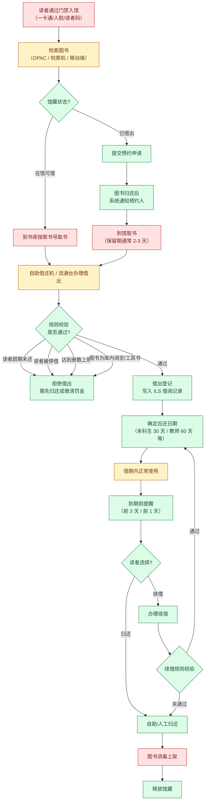
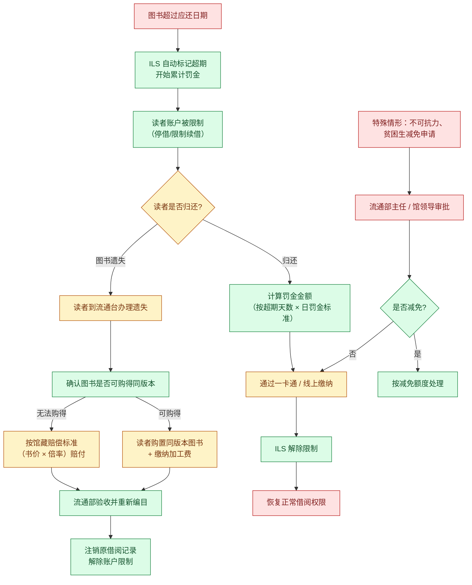
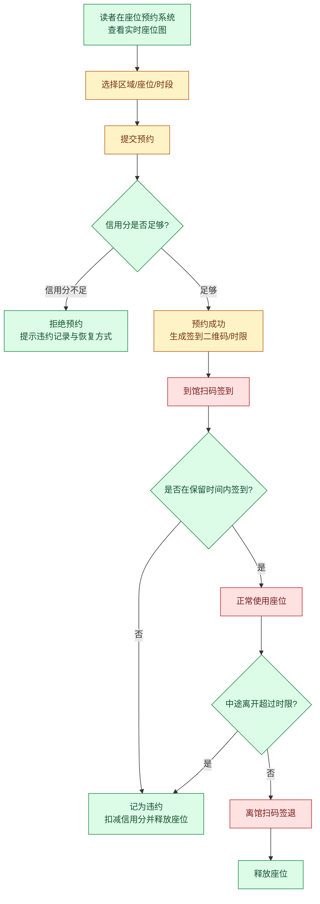
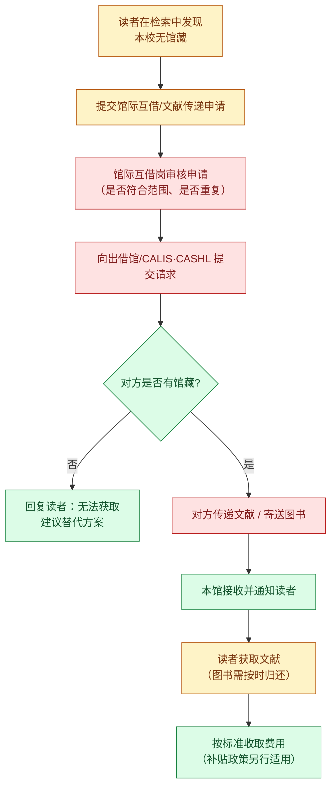
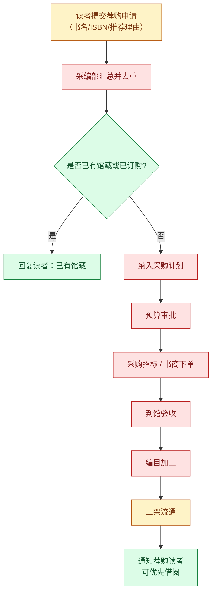

# 02 业务域：图书与资源服务（D3）

> 图书馆是**规则最清晰、风险最低、最适合 Agent 切入**的业务域。它的所有业务都由显式规则驱动（册数上限、借期、续借次数、超期罚则），几乎没有主观判断空间——这正是 AI 最擅长的形态。

---

## 1. 域内角色与系统

| 角色 | 职责 |
|---|---|
| 读者（学生/教师/职工） | 检索、借阅、续借、预约、荐购、座位预约 |
| 流通部 | 借还服务、超期处理、赔书定损、书库管理 |
| 采编部 | 图书采购、编目、加工、上架 |
| 阅览部 | 期刊、工具书、学位论文阅览管理 |
| 技术部 | ILS 运维、接口对接、自助设备 |
| 馆际互借/文献传递岗 | CALIS / BALIS / CASHL 馆际借阅与文献传递 |

**关键系统与协议**

| 系统/协议 | 说明 | 对 Agent 的价值 |
|---|---|---|
| ILS（汇文 / 图创 Interlib 等） | 图书馆集成管理系统，馆藏与借阅的唯一权威源 | 数据来源 |
| OPAC | 面向读者的公共检索目录，多数提供 Web 检索与书目查询 | 可做只读查询接入 |
| **SIP2** | 流通设备与 ILS 之间的标准协议（自助借还机、门禁） | 标准协议，规则清晰，最理想的对接点 |
| Z39.50 / SRU | 跨库书目检索协议 | 书目检索 |
| 座位预约系统 | 独立于 ILS 的第三方系统（微信小程序/扫码） | 独立接入 |

> **行业理解要点：** 图书馆是高校里**标准化程度最高**的部门——SIP2 是国际通用协议，续借、查借阅状态在网络协议层面就是标准指令。**这意味着 Agent 可以做到真正的"对接"而非"爬取"**，工程上比教务系统干净得多。这也是阶段一选择图书借阅场景的核心原因之一。

---

## 2. 流程一：图书借阅

### 逐环节边界拆解

| 步骤 | 环节 | 标注 | 理由 | Agent 能做/不能做 |
|---|---|---|---|---|
| B1 | 入馆 | **H** | 物理行为 | — |
| B2 | 检索图书 | **AI** | 只读，书目公开 | ✅ 支持自然语言检索（"找一本讲认知心理学的入门书"），可对接 OPAC/SRU |
| B3 | 馆藏状态判断 | **AI** | 纯状态字段 | ✅ 可查实时在馆/借出状态与馆藏位置 |
| B4 | 取书 | **H** | 物理行为 | ✅ 可提供**索书号 + 楼层 + 书架导航指引** |
| B5 | 提交预约 | **AI+H** | 写操作但低风险、可撤销 | ✅ **可代为提交**（列入白名单的写操作），须先向用户确认 |
| B6 | 到馆通知 | **AI** | 事件驱动 | ✅ **高价值**：保留期仅 2-3 天，错过即释放，通知是刚需 |
| B7 | 到馆取书 | **H** | 物理行为 | ✅ 可做倒计时提醒 |
| B8 | 办理借出 | **AI+H** | 涉及身份与实物 | ✅ 可引导自助机操作流程；❌ Agent 不替代物理借书 |
| B9 | 规则校验 | **AI** | 纯规则引擎 | ✅ **可在借阅前预检**："你有 1 本超期，需先归还才能借新书"——这是极佳的体验提升点 |
| B10 | 拒绝借出 | **AI** | 规则明确 | ✅ 可解释具体原因与解决办法（去哪个柜台、缴多少罚金） |
| B11/B12 | 借出登记与应还日期 | **AI** | 系统自动 | ✅ 可读取并计入提醒引擎 |
| B13 | 借期内 | — | — | — |
| B14 | 到期提醒 | **AI** | 零风险高价值 | ✅ **阶段一核心能力** |
| B15/B16/B18 | 续借与校验 | **AI** | **规则完全明确、结果可逆** | ✅ **可全自动执行**（阶段一唯一的写操作白名单）。校验项：未超期、未被他人预约、未超续借次数 |
| B17 | 归还 | **AI+H** | 物理行为 | ✅ 可提醒、可指引 |
| B19/B20 | 上架与释放 | **H** | 物理行为 | ✅ 只读展示状态变化 |

> **为什么"续借"可以给 Agent 自动执行？**
> 1. 结果**完全可逆**（续借失败不影响任何权益，重新操作即可）；
> 2. 规则**完全显式**（ILS 在调用时就会返回可否续借及原因，无需 AI 判断）；
> 3. 出错**无制度后果**（不进档案、不影响学籍）；
> 4. 有**标准协议**（SIP2 续借指令 / ILS REST 接口）。
> → 满足全部四项，故列入白名单。**对照看：教务选课同样是写操作，但它影响学分与毕业，故不列入。**

---

## 3. 流程二：超期与赔书

| 步骤 | 环节 | 标注 | Agent 能做/不能做 |
|---|---|---|---|
| O1-O3 | 超期标记与限制 | **AI** | ✅ **可在超期前主动预警**（提前 3 天 / 1 天），并解释超期后果 |
| O4/O9 | 归还或遗失 | **AI+H** | ✅ 可给出分流指引：能还就还，找不到书按遗失办理 |
| O5 | 罚金计算 | **AI** | ✅ 可精确计算并展示明细（天数 × 单价） |
| O6 | 缴纳 | **AI+H** | ✅ 可引导缴纳入口；⚠️ **涉及资金，Agent 只做跳转与说明，不代扣款** |
| O7/O8 | 解除限制 | **AI** | ✅ 只读展示 |
| O10 | 是否可购得同版本 | **AI+H** | ✅ 可辅助检索在售同版本（ISBN 比对），**最终判定由流通部** |
| O11/O12 | 赔偿执行 | **H** | ❌ 定损是资产处置，必须人工 |
| O13/O14 | 验收与注销 | **H** | ❌ |
| O15-O18 | 减免审批 | **H** | ❌ **绝对禁止 Agent 参与**——涉及经济状况与人为裁量，且具救济性质（红线 R1/R4） |

---

## 4. 流程三：座位与研讨间预约

| 步骤 | 环节 | 标注 | Agent 能做/不能做 |
|---|---|---|---|
| R1 | 查看座位图 | **AI** | ✅ 可查询并推荐"当前有空位的区域"（如按楼层、靠窗、有插座等偏好） |
| R2/R3 | 选择与提交预约 | **AI+H** | ✅ 可代提交（低风险可撤销，同 B5 白名单） |
| R4/R5 | 信用分校验与拒绝 | **AI** | ✅ 可提前告知信用分与违约记录 |
| R6 | 预约成功 | **AI** | ✅ 可写日历 + 签到倒计时提醒 |
| R7/R12 | 扫码签到/签退 | **H** | ✅ 可提醒（**违约会被扣信用分，属于"可避免的损失"**，提醒价值高） |
| R8/R9/R11 | 违约判定 | **AI** | ✅ 只读展示 |
| R10/R13 | 使用与释放 | **H** | — |

> **说明：** 座位预约系统通常是独立第三方系统。Agent 接入方式为小程序跳转 + 消息提醒，**在缺少开放接口时以"提醒 + 跳转"降级实现，不强行对接**。

---

## 5. 流程四：文献传递与馆际互借

| 步骤 | 环节 | 标注 | Agent 能做/不能做 |
|---|---|---|---|
| C1 | 发现无馆藏 | **AI** | ✅ **检索时同步提示"本馆无馆藏 → 可申请文献传递"**，把服务前置到用户发现问题的当下 |
| C2 | 提交申请 | **AI+H** | ✅ 代填书目信息（ISBN/题名/作者自动带出）+ 材料校验 |
| C3/C4 | 审核与转出 | **H** | ❌ 涉及费用与馆际协议 |
| C5/C6 | 可获取性判定 | **H** | ❌ 需人工与对方馆沟通 |
| C7/C8 | 传递与接收 | **H** | ✅ 可推送进度 |
| C9/C10 | 获取与收费 | **AI+H** | ✅ 可提醒归还期限（属性同借阅） |

---

## 6. 流程五：读者荐购

| 步骤 | 环节 | 标注 | Agent 能做/不能做 |
|---|---|---|---|
| A1 | 提交荐购 | **AI+H** | ✅ 可代填书目（ISBN 自动补全题名/作者/出版社）；❌ 不代提交 |
| A2 | 汇总去重 | **AI+H** | ✅ 可自动查重（与馆藏、在订清单比对）并提示"已有馆藏/已被 3 人荐购" |
| A3/A4 | 已有馆藏判定 | **AI** | ✅ 只读比对 |
| A5-A9 | 采购至加工 | **H** | ❌ 预算与资产流程 |
| A10/A11 | 上架与通知 | **AI** | ✅ **可推送"你荐购的《X》已上架"**——情感价值高，成本极低 |

---

## 7. 本域边界汇总

| 类别 | 环节 | 准则 |
|---|---|---|
| ✅ **AI 可全自动** | 书目检索、馆藏状态查询、借阅记录查询、到期提醒、**续借**、超期预警与罚金计算、座位查询与提醒、荐购上架通知、预约到馆通知 | 只读 或 可逆写；规则由 ILS 显式返回，Agent 不做判断 |
| 🟡 **AI 准备 + 人工确认** | 预约提交、缴纳引导、文献传递申请填写、荐购单填写、遗失后的同版本检索 | 涉及金额或不可撤销承诺，需用户显式确认 |
| 🔴 **禁止 AI 介入** | 赔偿定损、减免审批、馆际互借可获取性判定、采购与预算审批 | 资产处置与人为裁量 |

**核心结论（对阶段一的输入）：** 本域的**「借阅查询 + 到期提醒 + 续借」**构成一条**完整闭合、零制度风险、且有标准协议支撑**的链路，是校园智能体最理想的首个落地场景。

---

**上一篇** → [01 业务域：教务与学工](./01-业务域-教务与学工.md)
**下一篇** → [03 业务域：后勤生活与迎新离校](./03-业务域-后勤生活与迎新离校.md)
