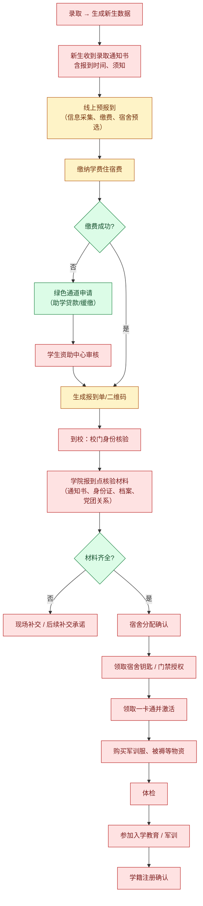
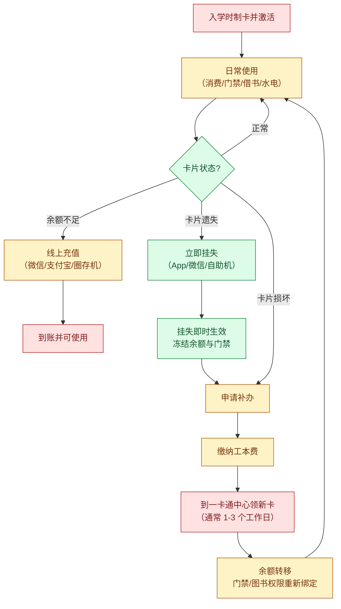
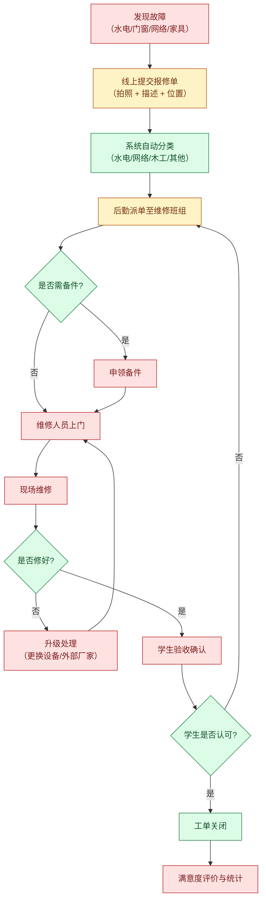
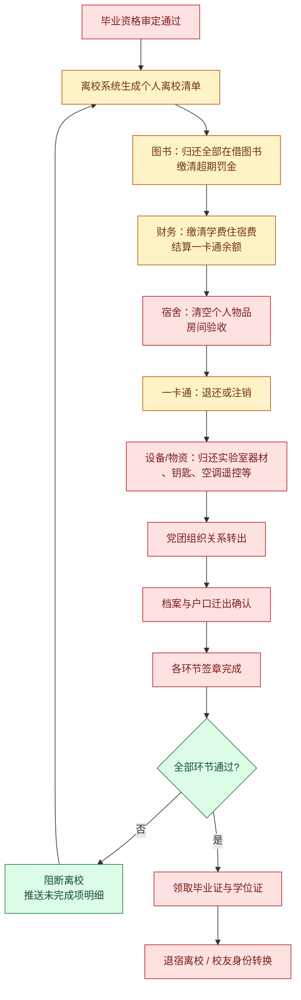

# 03 业务域：后勤生活与迎新离校（D5 / D4）

> 这个域的特点是**线下环节密度最高**——报修要进宿舍、报到要排队、门禁要刷卡。AI 在这里的价值不是"替人做事"，而是**把线下流程的等待、排队、跑腿成本转移到线上**。

---

## 1. 域内角色与系统

| 角色 | 职责 |
|---|---|
| 学生 | 报到、住宿、报修、消费、离校 |
| 辅导员 | 迎新对接、宿舍调整、离校审批 |
| 后勤处 | 宿舍分配、维修派单、水电管理、食堂 |
| 财务处 | 学费收缴、一卡通充值、退费结算 |
| 保卫处 | 门禁、车辆、安全 |
| 一卡通中心 | 卡务、挂失解挂、补办 |

---

## 2. 流程一：迎新报到

### 逐环节边界拆解

| 步骤 | 环节 | 标注 | Agent 能做/不能做 |
|---|---|---|---|
| Y1/Y2 | 录取与通知书 | **H** | — |
| Y3 | 线上预报到 | **AI+H** | ✅ **可做"材料清单 + 填写指引 + 填写校验"**：如身份证号位数、照片规格、档案寄送地址自动核对；❌ 不代提交 |
| Y4 | 缴费 | **AI+H** | ✅ 可引导缴费入口、说明收费项构成；⚠️ 涉资金，不代扣 |
| Y5/Y6 | 绿色通道 | **AI+H** | ⚠️ **高敏感**：可说明政策与流程，**不做资格判断**（红线 R1/R3），一律引导至学生资助中心 |
| Y7 | 资助中心审核 | **H** | ❌ |
| Y8 | 生成报到单 | **AI** | ✅ 可生成报到路线图（先去哪、再去哪、每处耗时） |
| Y9-Y19 | 到校后的线下环节 | **H**（物理行为） | ✅ Agent 的定位是**「报到向导」**：实时告知"你当前应在 X 处，下一站是 Y，需带 Z 材料"、排队情况、各点工作时间，把线下找路的认知成本降到最低 |

---

## 3. 流程二：一卡通业务

| 步骤 | 环节 | 标注 | Agent 能做/不能做 |
|---|---|---|---|
| K1 | 制卡激活 | **H** | — |
| K2 | 日常使用 | **AI** | ✅ 可查询余额、消费流水、门禁记录 |
| K3 | 状态判断 | **AI** | ✅ |
| K4 | 充值 | **AI+H** | ✅ 可引导；⚠️ **涉资金，Agent 只跳转不代付** |
| K6/K7 | **挂失** | **AI** | ✅ **可代执行**（白名单写操作）：挂失是**降低损失**的动作、可逆（解挂）、规则显式、出错无制度后果。**这是"AI 能在紧急场景帮上忙"的典型**——丢卡时学生最需要的是"立刻冻结"而不是"教我怎么冻结" |
| K8/K9 | 补办与缴费 | **AI+H** | ✅ 可预填申请、说明所需材料与领卡点 |
| K10 | 领卡 | **H** | ✅ 可做到卡通知 |
| K11 | 余额转移与权限绑定 | **H** | ✅ 可提示"图书借阅权限需重新绑定，期间无法借书" |

> **重要提示（红线 R1 的反向应用）：** 挂失可自动化，但**解挂必须人工或强身份校验**——解挂若被冒用，等同于把资产交给攻击者。这条差异说明"可逆性"是双向判断，**降低风险的操作可以放开，恢复权限的操作必须收紧**。

---

## 4. 流程三：宿舍报修

| 步骤 | 环节 | 标注 | Agent 能做/不能做 |
|---|---|---|---|
| F1/F2 | 发现与提交报修 | **AI+H** | ✅ **高价值**：可做"故障自助排查"（网络不通 → 先查是否欠费/是否需重启/是否全校断网），把 30% 的无效工单挡在前面；可自动填充报修单（位置、设备编号） |
| F3 | 自动分类 | **AI** | ✅ 可基于描述文本做**智能分类与优先级判定**（漏水/断电 → 紧急） |
| F4 | 派单 | **AI+H** | ✅ 可推荐班组（按区域、工种、当前负荷）；❌ 最终派单由后勤确认 |
| F5/F6 | 备件申领 | **H** | ❌ 物资流程 |
| F7/F8 | 上门与维修 | **H** | ✅ 可推送"维修师傅已出发，预计 X 分钟到" |
| F9/F10 | 修好与否 | **H** | — |
| F11/F12 | 验收确认 | **H** | ⚠️ **必须人工**：验收是责任划分动作，AI 不得代签 |
| F13/F14 | 关闭与评价 | **AI** | ✅ 可提醒评价、可做统计看板 |

---

## 5. 流程四：毕业离校

| 步骤 | 环节 | 标注 | Agent 能做/不能做 |
|---|---|---|---|
| L1 | 毕业资格审定 | **H** | ❌ 红线 R1 |
| L2 | 生成离校清单 | **AI** | ✅ **全场景最佳用例之一**：离校是典型的"多部门串联 checklist"，Agent 可**聚合 6 个系统的状态**，输出"你还剩 3 项未完成：图书馆 2 本未还、一卡通欠费 12 元、宿舍未验收"，并按截止时间排序 |
| L3-L7 | 各环节办理 | **AI+H** | ✅ 可查状态、可提醒、可给办理指引；❌ 不代签章 |
| L8/L9 | 组织关系与档案 | **H** | ✅ 可推送进度 |
| L10 | 签章 | **H** | ❌ |
| L11/L12 | 阻断判定 | **AI** | ✅ 可主动预警"距离离校截止还有 X 天，你还有 Y 项未完成" |
| L13/L14 | 领证与退宿 | **H** | ✅ 可通知领取时间地点 |

> **行业洞察：** 离校季是高校**咨询量峰值**（各类"我能不能走""去哪盖章"）。这类问题的特征是**答案完全确定、只是散落在 6 个系统里**——这正是 Agent 最应该解决的问题，也是最能体现"用 AI 打通烟囱"价值的地方。

---

## 6. 本域边界汇总

| 类别 | 环节 | 准则 |
|---|---|---|
| ✅ **AI 可全自动** | 一卡通余额/流水/门禁查询、**挂失**、报修单智能分类与优先级、故障自助排查、离校清单聚合与阻断预警、各类进度查询与提醒 | 只读 或 降低风险的写操作 |
| 🟡 **AI 准备 + 人工确认** | 报到材料校验、充值引导、报修单预填、派单推荐、补办申请预填、缴费指引 | 涉资金/物资，需人工确认或跳转 |
| 🔴 **禁止 AI 介入** | 绿色通道资格认定、宿舍分配裁定、维修验收签章、组织关系转出、离校签章、毕业结论 | 责任划分、资产处置、终局性认定 |

---

## 7. 三个业务域横向对比（为阶段一选型做铺垫）

| 维度 | D1 教务学工 | D2/D3 图书（简化为 D3） | D5 后勤生活 |
|---|---|---|---|
| 业务频次 | 高（每周） | **高（每周多次）** | 低（每月） |
| 数据标准化 | 低（多为页面/私有接口） | **高（SIP2/OPAC 标准协议）** | 中 |
| 出错后果 | **极高（进档案）** | **极低（可逆）** | 中（涉资金/资产） |
| 规则显式程度 | 中（含大量制度裁量） | **极高（纯规则）** | 中 |
| 人工审批密度 | **极高** | 低 | 中 |
| **阶段一适配度** | 只做只读查询 | ★★★★★ **首选** | ★★ |

**下一篇** → [10 阶段一：校园助手 Agent 设计（主文档）](./10-阶段一-校园助手Agent设计.md)
