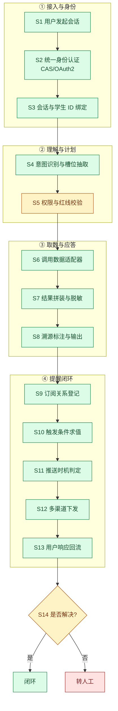
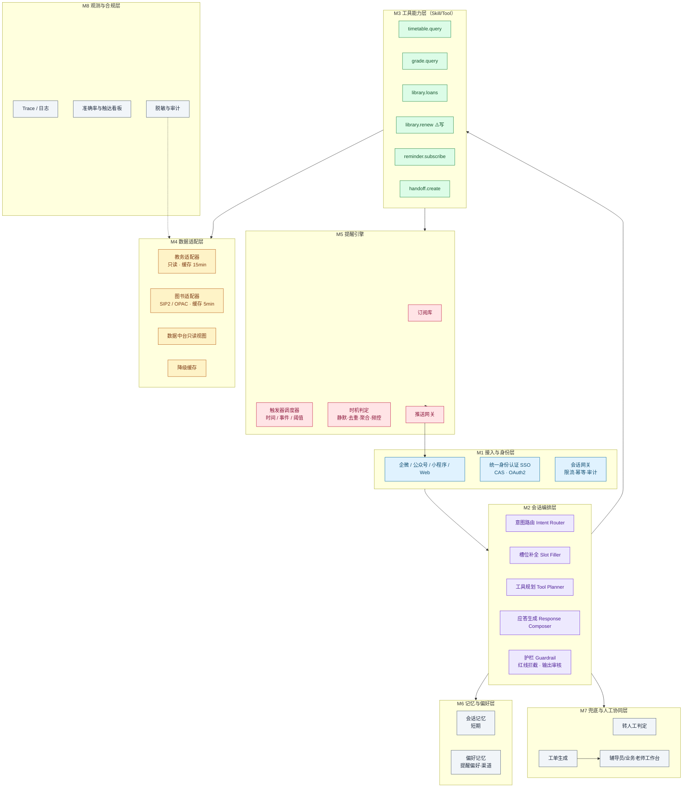
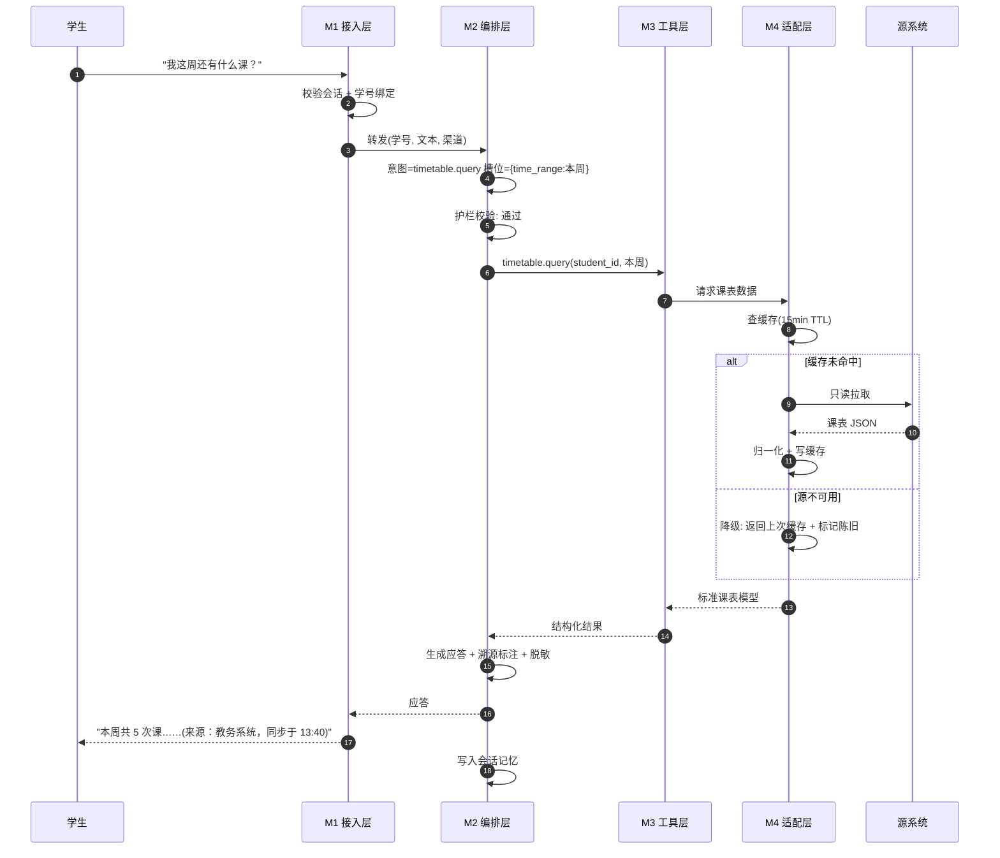
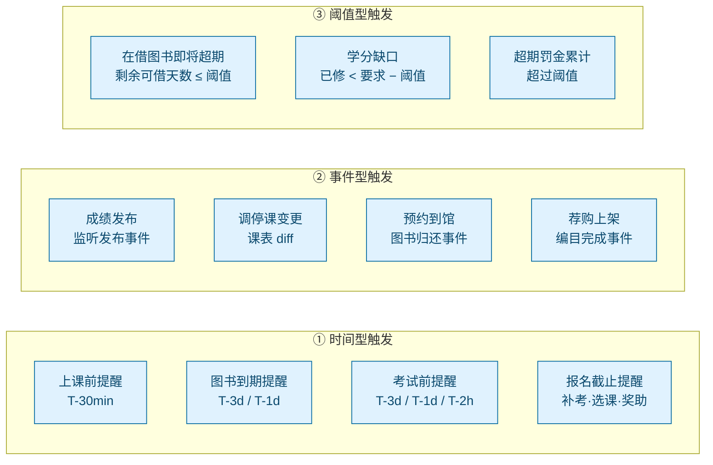
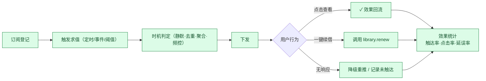

# 10 阶段一：校园助手 Agent 设计（主文档）

> **交付范围**：课表查询、成绩查询、图书馆借阅信息查询、自动提醒。
> **一句话定位**：Agent 是学生与校内各业务系统之间的**统一信息层**——它不改变任何业务规则，只负责把"散落在 7 个系统里的、与学生本人相关的、规则明确的信息"用自然语言一次性交付，并在正确的时间主动送达。

---

## 1. 阶段一定位

### 1.1 目标

| 目标 | 可度量标准 |
|---|---|
| G1 统一入口 | 学生不再需要记住"查课表去 A、查借阅去 B"，一个对话入口覆盖四类信息 |
| G2 主动触达 | 到期、开课、发布等**时间敏感事件**在错过前送达，触达率 ≥ 95% |
| G3 零制度风险 | 阶段一**不产生任何不可逆的档案/学籍/财务后果**，异常时可整体回滚 |
| G4 可衡量可信 | 所有回答可溯源（来源系统 + 同步时间），事实一致性抽样准确率 ≥ 99.5% |
| G5 边界清晰 | 每个失败路径都有明确的转人工出口，不含"猜答案"分支 |

### 1.2 明确不做（Scope Out）

用否定的方式界定边界，比列举功能更重要：

| 不做 | 原因 |
|---|---|
| ❌ 不代学生选课、报名补考、提交复核申请 | 主张性/影响学分的写操作，红线 R1/R4 |
| ❌ 不判断挂科、毕业资格、评优资格 | 终局性结论，红线 R1 |
| ❌ 不代缴任何费用 | 涉资金 |
| ❌ 不处理心理、处分、家庭经济信息 | 敏感个人信息，红线 R3 |
| ❌ 不提供"选课推荐/专业建议" | 低确定性 + 会影响学生重大决定，属阶段三范围 |
| ❌ 不生成任何对外公示文本 | 红线 R3 |
| ✅ 唯一写操作：**图书续借**（可逆、规则显式、无制度后果） | 见第 6.4 节论证 |

---

## 2. 链路选型论证

### 2.1 候选链路

从三篇业务域文档中，提取出三条"起止清晰、可闭合"的候选链路：

| 链路 | 起点 → 终点 | 涉及系统 | 评述 |
|---|---|---|---|
| **L1 学业信息与提醒链路** | 学生提问/定时触发 → 课表·成绩·借阅信息交付 + 主动提醒 | 教务、图书馆、SSO、消息通道 | **选中** |
| L2 办事向导链路 | 学生想办一件事 → 材料清单 + 表单预填 + 进度跟踪 | 办事大厅、各业务系统 | 价值高但依赖流程数据未结构化，置于阶段二 |
| L3 离校办理链路 | 毕业审定通过 → 六系统清单聚合 → 全部签章完成 | 六系统 | 场景极佳但**低频**（每年一次），不适合作为 MVP 验证 |

### 2.2 评分（1-5 分，5 为最优）

| 评估维度 | L1 学业信息与提醒 | L2 办事向导 | L3 离校办理 |
|---|---|---|---|
| 使用频次 | **5** | 3 | 1 |
| 数据可得性 | **4**（教务只读 + ILS 标准协议） | 2（流程数据散、未结构化） | 3 |
| 规则显式程度 | **5**（四类能力几乎无裁量） | 3 | 4 |
| 出错后果可控性 | **5**（只读为主，可逆） | 4 | 2（影响毕业） |
| 价值可度量 | **5**（准确率、触达率、转人工率均可量化） | 3 | 3 |
| 可复用基建 | **5**（身份、适配器、消息通道、提醒引擎均为后续阶段底座） | 4 | 4 |
| **合计** | **29** | 19 | 17 |

### 2.3 选型结论

**选择 L1「学业信息与提醒链路」**，理由：

1. **它是所有后续阶段的基础设施。** 身份接入、数据适配器、消息通道、提醒引擎、转人工协议——这五项在 L1 中全部要被建起来，而它们在阶段二/三/四中一个都不会浪费。**做 L1 = 做完底座。**
2. **它同时覆盖了"高频查询"与"主动服务"两种形态。** 前者验证 Agent 的准确性与体验，后者验证最有商业价值的能力——**从"学生来问"到"Agent 主动告诉"**。
3. **它的风险轮廓允许快速上线。** 只读 + 一个可逆写操作，即使全量失败也只是"查不到"，不会造成任何制度性损害，可以大胆灰度。
4. **它有清晰的失败边界。** 数据源不可用 → 降级；超出能力范围 → 转人工。没有灰区。

### 2.4 链路内环节的 AI / 人工拆解（核心交付之一）

把 L1 链路拆成 14 个环节，逐一标注（详细矩阵见文档 11）：



| 环节 | 标注 | AI 具体执行什么 | 人工兜底什么 |
|---|---|---|---|
| S1 发起会话 | **AI** | 识别渠道（微信/企微/小程序/Web），建立会话上下文 | — |
| S2 统一身份认证 | **AI** | 跳转 CAS/OAuth2 完成登录，获取学号 | 遗忘密码 → 转信息中心（AI 不给绕过路径） |
| S3 会话绑定 | **AI** | 将会话与学号、角色（本/硕/教师）绑定，注入权限上下文 | 账号异常/被锁定 → 转人工 |
| S4 意图识别 | **AI** | 四类意图分类 + 槽位抽取 + 多轮补全 | 连续 2 轮未识别 → 转人工 |
| S5 权限与红线校验 | **AI+H** | 自动拦截越权请求（如查他人成绩）与红线请求（如"我能毕业吗"） | 拦截后由人（辅导员/教务处）答复 |
| S6 调用适配器 | **AI** | 按意图调用对应工具，超时/失败走降级 | 数据源长期不可用 → 运维人工介入 + 公告 |
| S7 结果拼装与脱敏 | **AI** | 结构化数据转自然语言，敏感字段脱敏 | — |
| S8 溯源标注 | **AI** | 强制附加「来源系统 + 同步时间 + 以源系统为准」 | — |
| S9 订阅登记 | **AI** | 将用户订阅（提醒偏好）写入订阅库 | 用户要求关闭所有提醒 → 允许，但需二次确认 |
| S10 触发求值 | **AI** | 定时/事件/阈值三类求值 | — |
| S11 时机判定 | **AI** | 静默期、去重、聚合、频控 | — |
| S12 下发 | **AI** | 多渠道下发（企微 > 公众号 > 短信降级） | 通道整体故障 → 转管理员人工公告 |
| S13 响应回流 | **AI** | 记录打开/点击/续借等行为，回写效果数据 | — |
| S14 是否解决 | **AI+H** | 自动判定"未解决"信号（重复提问、负反馈） | **硬转人工**：生成工单，附完整上下文 |
| S15/S16 | — | 闭环归档 | 人工在 SLA 内响应 |

> **关键结论：L1 链路 14 个环节中，AI 可全自动 12 个，AI 辅助 2 个，纯人工兜底仅出现在"最终争议答复"与"账号/数据源异常"两类场景。** 这是选择它作为 MVP 的核心理由——**自动化率高，且自动化不产生任何制度风险**。

---

## 3. 系统架构与模块职责

### 3.1 分层架构



### 3.2 模块职责表（含明确的不负责事项）

| 模块 | 核心职责 | **明确不负责** | 关键指标 |
|---|---|---|---|
| **M1 接入与身份层** | 多渠道会话接入、SSO 认证、会话与学号绑定、限流与审计 | ❌ 不做密码找回；❌ 不做未认证的匿名数据访问；❌ 不做跨账号查询 | 认证成功率 ≥99.9%、会话建立 P95 < 800ms |
| **M2 会话编排层** | 意图识别、槽位补全、工具选择、结果生成、**红线拦截** | ❌ 不做业务规则判断（如"能否毕业"）；❌ 不自行计算学分结论；❌ 不对源系统的状态字段做二次解释 | 意图准确率 ≥95%、红线拦截召回率 **100%** |
| **M3 工具能力层** | 把业务能力封装为可被 Agent 调用的确定性函数，每个工具**单一职责、出入参强类型** | ❌ 工具内不做自然语言生成；❌ 除 `library.renew` 外无写操作；❌ 不做跨系统数据 JOIN 推断 | 工具调用成功率 ≥99%、P95 延迟 < 2s |
| **M4 数据适配层** | 屏蔽异构系统差异，统一为内部数据模型；缓存与降级 | ❌ **不做绕过统一身份认证的抓取**；❌ 不做写操作（除续借）；❌ 不在适配层做业务规则 | 同步时效（课表 ≤15min、借阅 ≤5min）、可用性 ≥99.5% |
| **M5 提醒引擎** | 订阅管理、三类触发求值、时机判定、多渠道下发 | ❌ 不推送未订阅内容（除学校紧急通知白名单）；❌ 不做营销化推送；❌ 不在静默期推送非紧急消息 | 触达率 ≥95%、误报率 ≤1%、退订率 ≤2% |
| **M6 记忆与偏好层** | 记住提醒偏好、渠道偏好、常用课程/馆藏 | ❌ **不存储成绩明细、不生成学业画像标签**（红线 R3）；❌ 不做跨用户聚合 | 偏好命中率、记忆有效期管理 |
| **M7 兜底与人工协同层** | 判定需转人工的场景、生成带完整上下文的工单、跟踪 SLA | ❌ 不做自动答复替代人工结论；❌ 不代学生表达诉求（红线 R4） | 转人工率 ≤8%、转人工上下文完整率 100%、响应 SLA 达标率 ≥95% |
| **M8 观测与合规层** | 全链路 Trace、双通道评测、脱敏、审计留痕 | ❌ 日志中不得出现完整成绩/身份证号/银行卡号 | 评测覆盖率 100%、审计可回溯 ≥180 天 |

### 3.3 模块协作关系（一次典型查询）



---

## 4. 能力一：课表查询

### 4.1 能力定义

| 项 | 内容 |
|---|---|
| 意图标识 | `timetable.query` |
| 触发语句示例 | "我明天有什么课"、"这周的课表"、"下节课在哪上"、"高数在哪个教室"、"我周三下午有课吗" |
| 权限 | 仅本人课表。教师可查本人授课课表，**不可查学生课表** |
| 数据源 | 教务系统（只读），课表数据 |
| 缓存 TTL | 15 分钟（调停课高发期缩短至 5 分钟） |
| 写操作 | 无 |

### 4.2 槽位与解析规则

| 槽位 | 取值 | 缺省策略 |
|---|---|---|
| `time_range` | 今天 / 明天 / 本周 / 下周 / 指定日期 / 指定周次 | 缺省 = 今天；若今天无课且已过 18:00，**主动提示**"明天有 X 节课" |
| `course_name` | 课程名（模糊匹配） | 缺省 = 全部课程 |
| `dimension` | 时间视角 / 课程视角 | 缺省 = 时间视角 |

### 4.3 输出规范

```
📅 你今天（9 月 18 日 周四）有 3 节课

1️⃣ 08:00-09:40  高等数学A(二)
   📍 教学楼 3-402  👨🏫 张××
2️⃣ 10:10-11:50  大学物理
   📍 实验楼 B-215  👨🏫 李××
3️⃣ 14:00-15:40  程序设计基础
   📍 信息楼 5-108  👨🏫 王××

⚡ 提示：程序设计基础本周改至信息楼 5-108（原 4-301）
📌 数据来源：教务系统 ｜ 同步于 13:40
```

**硬性输出要求：**
1. 调停课变更**必须显式高亮**（这是课表查询最有价值的信息，也是最容易被学生漏掉的）；
2. 必须携带溯源标注；
3. 涉及未发布的临时变动，标注"以教务系统最新为准"。

### 4.4 失败与降级路径

| 场景 | Agent 行为 | 边界标注 |
|---|---|---|
| 教务系统超时 | 返回最近缓存，标注「⚠️ 数据同步于 X，可能存在延迟」，同时后台重试 | **AI** |
| 缓存也为空（如新生尚未排课） | 明确告知"暂无课表数据，通常于开学前 X 日发布"，并提示关注教务处通知 | **AI** |
| 用户问"我为什么没课/是不是排错了" | 只陈述数据事实，**不做推断**，引导联系学院教务办 | **AI+H** → 转人工 |
| 用户问"这门课老师给分高吗" | 超出能力范围 + 涉评价他人，直接拒答并转人工 | **H** |

---

## 5. 能力二：成绩查询

> **本能力是全阶段一风险最高的一个**，因为成绩属于敏感信息且极易被追问出"判定性结论"。设计上采取"三不原则"。

### 5.1 能力定义

| 项 | 内容 |
|---|---|
| 意图标识 | `grade.query` |
| 触发语句示例 | "我上学期的成绩"、"高数考了多少"、"我绩点多少"、"我还差多少学分" |
| 权限 | **仅本人**。任何查询他人成绩的请求，一律拒绝并记录审计 |
| 数据源 | 教务系统（已发布的成绩） |
| 缓存 TTL | 不缓存明细（**每次实时拉取**），仅缓存"是否有新成绩发布"的事件标记 |
| 写操作 | 无 |

### 5.2 三不原则

| 原则 | 说明 | 反例（禁止输出） |
|---|---|---|
| **① 不下判定** | 只呈现源系统的原始状态字段（如系统标注的"及格/不及格""通过/未通过"），**不由 Agent 自行计算得出** | ❌ "你这门课挂了"<br/>❌ "你绩点不够保研" |
| **② 不做推演** | 不基于现有成绩推演未来结果（毕业、保研、评优） | ❌ "照这样你毕不了业"<br/>❌ "你肯定能拿奖学金" |
| **③ 不落记忆** | 成绩明细不写入任何长期存储、不生成标签、不参与个性化推荐 | ❌ 在记忆中标记"该生学业困难" |

> **补充规则（学分核算的例外说明）：** 用户主动询问"我还差多少学分"时，允许做**算术汇总**（已修学分 − 培养方案要求），但必须同时输出：①统计口径说明；②"预核算结果，最终以教务处认定为准"；③引导入口。**算术是允许的，判定是不允许的**——这是本能力的关键分界线。

### 5.3 输出规范

```
📊 2025-2026 学年第一学期成绩（已发布 8 门）

高等数学A(二)     88   ✅ 通过
大学物理          76   ✅ 通过
程序设计基础      92   ✅ 通过
大学英语(三)      64   ✅ 通过
...

📈 算术平均分 79.4（口径：已发布课程的总评成绩）
📌 数据来源：教务系统 ｜ 同步于 13:42
⚠️ 以上为原始成绩呈现，成绩认定及各类资格判定以教务处正式结论为准。
```

### 5.4 高危追问的标准应答（护栏）

| 用户问法 | Agent 应答策略 | 边界 |
|---|---|---|
| "我挂了没？" | 呈现源系统状态字段原文 + "认定以教务处为准" | **AI+H** |
| "我能毕业吗？" | **硬转人工** + 引导至学院教务办 | **H** |
| "这成绩是不是错了？" | 解释复核政策、时限、所需材料，提供预填入口（**不代提交**） | **AI+H** |
| "我算不算学业预警？" | 说明学校预警规则原文，**不判定本人是否命中**，引导咨询辅导员 | **H** |
| "帮我把成绩改一下" | 直接拒绝 + 说明违规性质 | **H** |

---

## 6. 能力三：图书馆借阅信息查询

### 6.1 能力定义

| 项 | 内容 |
|---|---|
| 意图标识 | `library.loans`（查询）/ `library.renew`（续借，唯一写操作） |
| 触发语句示例 | "我借了哪些书"、"还有几天到期"、"帮我续借"、"我是不是有书要还"、"有没有超期" |
| 权限 | 仅本人借阅记录 |
| 数据源 | ILS（SIP2 / OPAC 只读接口） |
| 缓存 TTL | 5 分钟（借阅状态变化频繁） |
| 写操作 | **`library.renew` 续借（白名单，需二次确认）** |

### 6.2 续借写操作的准入论证

一个写操作要进入白名单，必须同时满足四项条件：

| 准入条件 | 续借是否满足 | 对照：选课/报名补考 |
|---|---|---|
| ① 结果完全可逆 | ✅ 续借失败不影响任何权益，重试即可 | ❌ 影响学分与毕业 |
| ② 规则完全显式 | ✅ ILS 在调用时返回"可否续借 + 拒绝原因"，无需 AI 判断 | ⚠️ 涉及抢课、容量、优先级 |
| ③ 出错无制度后果 | ✅ 不进档案、不影响学籍、不涉资金 | ❌ 直接进档案 |
| ④ 有标准协议 | ✅ SIP2 / ILS REST | ❌ 多为页面表单 |
| **结论** | **准入** | **禁止** |

**执行约束（即使准入也须加约束）：**
- 必须**先展示续借结果预期**（新到期日），用户确认后才执行；
- 批量续借须逐条列出并整体确认；
- 续借失败时**不得重试超过 1 次**，直接转人工指引；
- 单次会话续借上限 10 次（防误触发）；
- 全过程审计留痕。

### 6.3 输出规范

```
📚 你在借图书 3 本

1️⃣ 《人工智能：现代方法》
   到期 9/20（2 天后）⚠️ 可续借 1 次
2️⃣ 《数据结构与算法分析》
   到期 9/28（10 天后）✅ 可续借 2 次
3️⃣ 《图书馆学概论》
   到期 9/16（已超期 2 天）🔴 需归还，罚金 0.4 元

💡 是否需要续借？回复"续借第 1 本"即可
📌 数据来源：图书馆系统 ｜ 同步于 13:45
```

**要点：**
- **按紧迫度排序**（超期 > 2 天内到期 > 其他）；
- 超期项**同时给出罚金金额与解决路径**（红线：只计算不代缴）；
- 可续借次数与不可续借原因直接来自 ILS，不由 AI 推断；
- 借阅记录属个人数据，输出中不含其他读者信息（如"他人已预约"仅说明状态，不透露预约人）。

### 6.4 到期提醒的联动

`library.loans` 查询结果会**自动登记为提醒订阅**——这是"查询即订阅"的设计：学生查过一次借阅，后续到期前自动收到提醒，无需额外操作。

---

## 7. 能力四：自动提醒引擎（阶段一的核心价值）

> **这是阶段一唯一"用户不主动提问也会发生"的能力，也是整个项目从"工具"变成"服务"的分界线。**

### 7.1 订阅模型

一条提醒订阅由五元组定义：

```
Subscription = (subject, trigger, timing, channel, priority)
```

| 元素 | 取值 | 说明 |
|---|---|---|
| `subject` | 课程 / 图书 / 成绩 / 考试 / 报名窗口 | 订阅对象 |
| `trigger` | 见 7.2 三类触发器 | 何时触发 |
| `timing` | 提前量（如 T-3d / T-1d / T-2h） | 提醒时机 |
| `channel` | 企微 / 公众号 / 小程序 / 短信降级 | 下发通道 |
| `priority` | P0 紧急 / P1 重要 / P2 常规 | 决定是否穿透静默期 |

### 7.2 三类触发器



### 7.3 阶段一提醒目录

| # | 提醒项 | 触发器 | 时机 | 优先级 | 不提醒的后果 | 边界 |
|---|---|---|---|---|---|---|
| 1 | 上课提醒 | 时间型 | T-30 分钟 | P2 | 迟到/缺课 | **AI** |
| 2 | 图书到期提醒 | 时间型 | T-3 天、T-1 天 | P1 | 超期罚金 + 停借 | **AI** |
| 3 | 图书超期预警 | 阈值型 | 一旦超期，每日 1 次（最多 3 次） | P1 | 罚金累积、影响毕业离校 | **AI** |
| 4 | 成绩发布提醒 | 事件型 | 发布后 10 分钟内 | P2 | 无实质损失（但满意度极高） | **AI** |
| 5 | 调停课变更提醒 | 事件型 | 变更生效后 10 分钟内 | **P0** | **跑错教室、错过补课** | **AI** |
| 6 | 考试安排提醒 | 时间型 | T-3 天、T-1 天、T-2 小时 | P1 | 错过考试 | **AI** |
| 7 | 补考报名截止提醒 | 时间型 | T-3 天、T-1 天、T-6 小时 | **P0** | **失去补考机会，影响学分** | **AI** |
| 8 | 预约到馆提醒 | 事件型 | 图书到馆后即时 + 每日 1 次（保留期内） | P1 | 预约失效、书被释放 | **AI** |

> **优先级设计依据（P0 判定标准）：** 一旦错过，**损失不可逆且涉学业利益**。补考报名与调停课变更满足这一标准，故设为 P0，可穿透静默期。

### 7.4 时机判定与防打扰（这是提醒引擎能不能被学生接受的关键）

| 机制 | 规则 | 目的 |
|---|---|---|
| **静默期** | 23:00–07:00 不推送 P2/P1；**仅 P0 可穿透** | 避免被视为骚扰 |
| **去重** | 同一 `(subject, trigger, 日期)` 只推一次；状态未变化不重复推 | 防止"催命式"提醒 |
| **聚合** | 同一时间窗内的多条提醒合并为一条摘要（如"你今天有 3 条提醒" → 展开明细） | 减少消息条数 |
| **频控** | 单用户单日提醒上限 8 条（P0 不计入） | 保护注意力 |
| **可退订** | 按订阅项粒度退订（可关"上课提醒"，保留"图书到期"） | 用户掌控感 |
| **降级链** | 主通道未读 6 小时 → 次通道 → 紧急项次日短信 | 保证触达 |
| **免打扰例外** | 学校发布的紧急通知（如停课、安全事件）走独立白名单通道 | 安全优先 |

### 7.5 提醒闭环



**核心效果指标：**「**损失规避率**」= 因提醒而避免的超期/错过报名次数 ÷ 应提醒总次数。这是本项目最有说服力的业务价值指标。

---

## 8. 人工兜底边界（阶段一版）

> 完整矩阵见[文档 11](./11-阶段一-AI可执行与人工兜底边界矩阵.md)。本节给出**必须记住的判定规则**。

### 8.1 三类兜底出口

| 出口 | 触发条件 | 处理方式 | SLA |
|---|---|---|---|
| **硬转人工（工单）** | ① 命中红线（毕业/学籍/处分/心理）<br/>② 数据源冲突且无法自证<br/>③ 连续 2 轮未解决<br/>④ 用户主动要求人工<br/>⑤ 涉争议或诉求表达 | 生成工单，附完整会话上下文 + 已查得数据 + 命中规则 | 工作时间 4 小时、紧急 30 分钟 |
| **软停靠（明确引导）** | 请求超出能力范围但无需人工介入（如查他人成绩） | 说明能力边界 + 给出正确渠道 + 不生成内容 | 即时 |
| **生命优先（特殊通道）** | 文本出现自伤/危机/安全类关键词 | **跳过所有流程**，直接展示校内 24h 求助通道 + 辅导员联系方式（红线 R5） | 即时 |

### 8.2 转人工工单必须包含（缺一不可）

```yaml
ticket:
  student_id: "2023xxxxxx"        # 经脱敏处理
  channel: "wecom"
  session_id: "sess_xxxxx"
  intent_history: ["grade.query", "grade.query"]   # 连续追问
  user_question: "我绩点不够，是不是不能毕业了"
  hit_rules: ["R1_终局性结论", "R3_敏感信息"]
  retrieved_facts:                                 # Agent 已查到的事实
    - source: "教务系统"
      synced_at: "2026-09-18T13:42:00+08:00"
      summary: "已发布 8 门课程成绩；算术平均分 79.4"
  agent_response_log: "..."                        # Agent 说过什么（避免人工重复解释）
  suggested_owner: "二级学院教务办 / 辅导员"
  priority: "P1"
```

> **设计要点：** 工单必须携带「Agent 已经说过什么」，否则人工坐席会重复询问，学生体验反而更差。这是"兜底"能否真正接住用户的关键细节。

### 8.3 阶段一红线执行清单

| 红线 | 阶段一的具体拦截点 |
|---|---|
| R1 不做终局结论 | 毕业 / 学籍 / 评优 / 保研 / 学位 类关键词 → 拦截并转人工 |
| R2 不做不可逆写 | 白名单仅 `library.renew`；`timetable.*` `grade.*` 全部只读 |
| R3 不加工敏感数据 | 成绩明细不落记忆、不生成标签、日志脱敏、不做跨用户聚合 |
| R4 不代表达诉求 | 复核申请、申诉、减免、异动申请一律"预填 + 引导"，不代提交 |
| R5 生命优先 | 危机关键词 → 特殊通道，最高优先级 |
| R6 不确定即转人工 | 置信度 < 0.75 或数据源冲突 → 转人工 |

---

## 9. 与后续阶段的衔接

阶段一建成的五项基建，将直接支撑后续阶段：

| 阶段一产出 | 阶段二（办事向导） | 阶段三（学业规划） | 阶段四（主动服务） |
|---|---|---|---|
| 统一身份与会话层 | 直接复用 | 直接复用 | 直接复用 |
| 数据适配器框架 | 新增办事流程适配器 | 新增人培方案适配器 | 全量接入数据中台 |
| 提醒引擎 | 扩展"流程待办"触发器 | 扩展"学分缺口"阈值 | 扩展个性化编排 |
| 转人工协议 | 复用 | 复用 | 复用 |
| 评测体系 | 复用 | 复用 | 复用 |

---

**相关文档** → [11 边界矩阵](./11-阶段一-AI可执行与人工兜底边界矩阵.md) ｜ [12 技术架构与数据契约](./12-技术架构与数据契约.md) ｜ [13 风控合规与评测上线](./13-阶段一-风控合规与评测上线.md)
