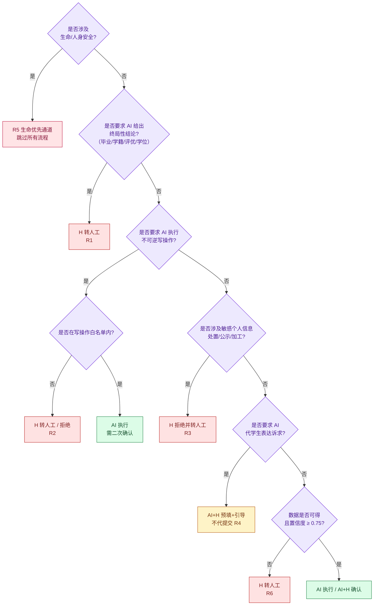
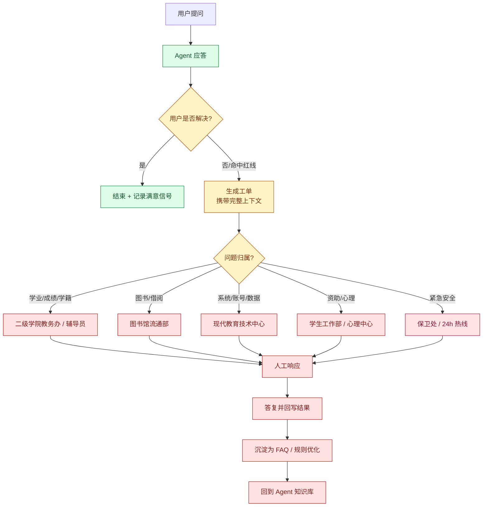

# 11 阶段一：AI 可执行与人工兜底边界矩阵

> 本文是阶段一的**边界宪法**。任何功能设计、代码实现、提示词编写，都必须能在这份矩阵里找到对应的行；**找不到对应行的行为，就是越界行为。**

---

## 1. 标注体系

| 标注 | 含义 | 判定依据 | 实现约束 |
|---|---|---|---|
| **`AI`** | AI 可全自动执行 | 只读 **或** 结果完全可逆；规则由源系统显式返回，无需 AI 判断 | 可直接执行，须留审计日志 |
| **`AI+H`** | AI 准备 + 人工/用户确认 | AI 可完成前置工作（查询、预填、校验、解释），但**提交、确认、裁定**必须由人完成 | 必须有显式确认步骤，禁止静默执行 |
| **`H`** | 禁止 AI 介入 | 终局性结论 / 不可逆后果 / 主观判断 / 主张性诉求 / 敏感数据处置 | 必须拦截并转人工，**不得生成替代性内容** |

**一个判断的口诀（实现时可作为规则引擎的判定顺序）：**



---

## 2. 逐环节边界矩阵（阶段一全量）

### 2.1 链路通用环节

| # | 环节 | 标注 | AI 边界（能做什么） | 人工边界（必须由谁做） |
|---|---|---|---|---|
| G-01 | 渠道接入 | **AI** | 识别渠道、建立会话 | — |
| G-02 | 统一身份认证 | **AI** | 跳转 SSO、校验票据、绑定学号 | 密码找回/账号锁定 → 信息中心 |
| G-03 | 身份与权限绑定 | **AI** | 注入角色与数据权限范围 | 角色错误 → 学籍科人工修正 |
| G-04 | 意图识别 | **AI** | 四类意图分类、槽位抽取、多轮补全 | 连续 2 轮失败 → 转人工 |
| G-05 | 红线拦截 | **AI** | 关键词 + 语义双通道拦截 | 拦截后的实际问题 → 对应部门 |
| G-06 | 工具选择与调用 | **AI** | 调用只读工具；白名单内写工具需确认 | — |
| G-07 | 结果呈现 | **AI** | 结构化转自然语言、按紧迫度排序、脱敏 | — |
| G-08 | 溯源标注 | **AI** | 附加来源 + 同步时间 + 免责口径 | 源数据本身错误 → 源系统管理部门 |
| G-09 | 数据源降级 | **AI** | 用缓存兜底并标注陈旧 | 长期不可用 → 运维 + 官方公告 |
| G-10 | 会话关闭 | **AI** | 记录结果与满意度信号 | — |

### 2.2 课表查询链（`timetable.query`）

| # | 环节 | 标注 | AI 边界 | 人工边界 |
|---|---|---|---|---|
| T-01 | 解析时间范围 | **AI** | 今天/明天/本周/指定周次 | — |
| T-02 | 拉取课表 | **AI** | 只读，缓存 15min | — |
| T-03 | 变更识别（diff） | **AI** | 对比上次快照，标出调停课 | — |
| T-04 | 呈现课表 | **AI** | 时间/地点/教师/变更高亮 | — |
| T-05 | 生成上课提醒 | **AI** | 自动登记时间型订阅 | — |
| T-06 | "我的课表是不是漏了/排错了" | **AI+H** | 陈述数据事实、给出课表版本时间 | ❌ 排课正确性判定 → 学院教务办 |
| T-07 | "老师给分严不严/这门课水不水" | **H** | ❌ 拒答 | 涉及评价他人，仅可在学生间非官方渠道交流 |
| T-08 | 教师查学生课表 | **H** | ❌ 拒绝（除非院系教务经授权） | 授权查询 → 教务管理员 |

### 2.3 成绩查询链（`grade.query`）

| # | 环节 | 标注 | AI 边界 | 人工边界 |
|---|---|---|---|---|
| S-01 | 拉取已发布成绩 | **AI** | 只读、**不缓存明细** | — |
| S-02 | 呈现成绩（原始字段） | **AI** | 呈现源系统的状态字段原文 | — |
| S-03 | 算术汇总（均分/学分） | **AI** | 允许算术，须标注口径 | — |
| S-04 | 学分缺口预核算 | **AI+H** | 只读计算 + "以教务处认定为准" | ❌ 认定 → 教务处 |
| S-05 | 及格与否的判定 | **H** | ❌ **禁止 Agent 自行计算得出**，只能引用源系统状态字段 | 认定 → 教务处 |
| S-06 | 毕业/学位/评优资格 | **H** | ❌ **硬转人工** | 教务处 / 学院 |
| S-07 | 成绩复核政策解释 | **AI** | 说明时限、流程、材料清单 | — |
| S-08 | 复核申请预填 | **AI+H** | 预填表单、校验材料完整度、截止倒计时 | ❌ 提交与裁定 → 学院/教务处 |
| S-09 | 成绩更正 | **H** | ❌ **绝对禁止** | 依流程多人签字 |
| S-10 | 查他人成绩 | **H** | ❌ 拒绝 + 审计留痕 | 授权查询 → 教务管理员 |
| S-11 | "帮我把成绩改一下" | **H** | ❌ 拒绝并说明违规性质 | — |
| S-12 | 成绩写入长期记忆 | **H** | ❌ 禁止（红线 R3） | — |

### 2.4 图书馆借阅链（`library.loans` / `library.renew`）

| # | 环节 | 标注 | AI 边界 | 人工边界 |
|---|---|---|---|---|
| L-01 | 查询在借清单 | **AI** | 只读，缓存 5min | — |
| L-02 | 计算剩余天数/超期天数 | **AI** | 允许算术 | — |
| L-03 | 可续借资格预判 | **AI** | 以 ILS 返回字段为准（未超期/未被预约/未超次数） | — |
| L-04 | **执行续借** | **AI** | ✅ 白名单写操作，须展示新到期日后确认 | 续借失败（如已被预约）→ 流通台 |
| L-05 | 超期罚金计算 | **AI** | 按公示标准计算并展示明细 | — |
| L-06 | 缴纳罚金 | **AI+H** | 引导缴纳入口 | ❌ 扣款 → 一卡通/财务 |
| L-07 | 到期/超期提醒 | **AI** | 订阅 + 定时触发 | — |
| L-08 | 图书查找与导航 | **AI** | 索书号 + 楼层 + 在馆状态 | ❌ 找不到书 → 流通台 |
| L-09 | 图书馆座位预约 | **AI+H** | 代提交（低风险可撤销） | 违约申诉 → 图书馆 |
| L-10 | 图书遗失赔偿定损 | **H** | ❌ 仅提供指引 | 流通部定损 |
| L-11 | 罚金减免申请 | **H** | ❌ **绝对禁止介入**（救济性质） | 流通部主任 / 馆领导 |
| L-12 | 荐购提交与采购 | **AI+H** | 查重、代填书目 | ❌ 采购决策 → 采编部 |

### 2.5 提醒引擎链

| # | 环节 | 标注 | AI 边界 | 人工边界 |
|---|---|---|---|---|
| R-01 | 订阅登记 | **AI** | 显式订阅 + 查询即订阅 | 用户要求全量关闭 → 二次确认后允许 |
| R-02 | 触发求值 | **AI** | 时间/事件/阈值 | — |
| R-03 | 静默期判定 | **AI** | 23:00–07:00 仅 P0 穿透 | — |
| R-04 | 去重与频控 | **AI** | 同项同日一次；单日上限 8 条 | — |
| R-05 | 多渠道下发 | **AI** | 主通道 → 次通道 → 短信降级 | 通道整体故障 → 管理员人工公告 |
| R-06 | 推送内容审核 | **AI+H** | 所有模板需人工审核后发布；AI 不得临时生成文案 | ❌ 内容定稿 → 学校宣传部/相关部门 |
| R-07 | 紧急通知（停课/安全） | **H** | ❌ 仅学校授权方可发起，走白名单通道 | 学校办公室/保卫处 |

---

## 3. 红线执行清单（可落地为规则引擎配置）

```yaml
redlines:
  R1_no_final_judgement:
    triggers: ["毕业", "学位", "肄业", "结业", "学籍", "保研", "推免", "评优", "能不能过", "会不会退学", "处分"]
    action: HARD_HANDOFF
    forbid: ["肯定/否定类判定表述", "后果推演"]
    sample_forbidden_output: "你这样的绩点无法毕业"

  R2_no_irreversible_write:
    whitelist:
      - library.renew
      - library.seat.reserve
    action_for_nonwhitelist: REJECT_OR_HANDOFF
    sample_forbidden_output: "已为你提交补考报名"

  R3_no_sensitive_processing:
    sensitive: ["成绩明细", "心理记录", "家庭经济情况", "处分记录", "身份证号", "银行卡号", "联系方式"]
    rules:
      - "不写入长期记忆"
      - "不生成用户标签"
      - "不参与跨用户聚合或排行"
      - "日志与工单中脱敏"
    sample_forbidden_output: "全班排名第 15 名"

  R4_no_claim_on_behalf:
    items: ["成绩复核申请", "学籍异动申请", "申诉", "减免申请", "举报", "信访"]
    action: PREFILL_AND_GUIDE
    sample_forbidden_output: "已代你向教务处提交复核申请"

  R5_life_first:
    triggers: ["自杀", "轻生", "不想活", "伤害自己", "伤害他人", "被威胁", "失联"]
    action: IMMEDIATE_SAFETY_CHANNEL
    bypass_all_flows: true
    content: ["校内24小时心理援助热线", "辅导员联系方式", "保卫处电话"]
    sample_forbidden_output: "（任何延迟、任何追问、任何分析）"

  R6_uncertain_handoff:
    conditions:
      - "intent_confidence < 0.75"
      - "数据源冲突且无法自证"
      - "连续 2 轮未解决"
      - "用户显式要求人工"
    action: HANDOFF
```

---

## 4. 转人工升级协议

### 4.1 升级路径



### 4.2 SLA 与归属

| 问题类型 | 归属 | 响应 SLA | 兜底方式 |
|---|---|---|---|
| 成绩/学籍/毕业类 | 二级学院教务办 | 工作时间 4 小时 | 电话 + 工单 |
| 图书借阅类 | 图书馆流通部 | 工作时间 8 小时 | 工单 + 到馆 |
| 系统/账号/数据异常 | 现代教育技术中心 | 2 小时（系统级故障 30 分钟） | 工单 + 公告 |
| 资助/心理类 | 学生工作部 / 心理中心 | 4 小时（心理危机**即时**） | 直接电话 |
| 安全/人身类 | 保卫处 | **即时** | 24h 热线 |

### 4.3 兜底质量指标

| 指标 | 目标 | 说明 |
|---|---|---|
| 转人工率 | ≤ 8% | 过高说明能力不足，过低说明该转的没转 |
| 工单上下文完整率 | **100%** | 缺任意必填字段即为不合格 |
| 转人工后二次转接率 | ≤ 10% | 反映归属判定是否准确 |
| 兜底后满意度 | ≥ 90% | **兜底体验决定整体口碑** |
| 红线漏拦截率 | **0**（零容忍） | 任一漏拦截视为 P0 事故 |

---

## 5. 边界设计的三个反直觉点

这三点是行业实践中容易被忽略、但在校园场景里至关重要的：

**① "可逆性"是双向判断的。** 一卡通**挂失**可以自动执行（降低风险），但**解挂**必须强身份校验或人工（恢复权限）——**同一业务的正反两个方向，边界是不同的。** 只按"业务"划边界会出错，必须按"动作方向 + 风险增减"划。

**② 允许"算术"，禁止"判定"。** 「已修 142 学分，要求 160 学分，差 18 学分」是算术，可以做；「你不满足毕业条件」是判定，不能做。**两者的数据来源完全相同，差别只在表述的定性。** 这是成绩能力中最容易越界的地方。

**③ 兜底工单要带"Agent 说过什么"。** 如果工单只带学生的原始问题，人工坐席会重新问一遍、重新解释一遍，学生体验比不用 Agent 更差。**兜底的目的是"接住"，不是"转走"。**

---

## 6. 边界自查清单（供 Code Review 与上线前检查使用）

- [ ] 新增的每个工具函数，是否在矩阵中有对应行？
- [ ] 新增的每个工具，是否标注了 `AI` / `AI+H` / `H`？
- [ ] 是否存在 AI 自行计算得出"结论性表述"的代码路径？
- [ ] 是否存在未确认即执行的写操作？
- [ ] 是否有敏感字段进入长期记忆或日志明文？
- [ ] 每条失败路径是否都有明确的兜底出口（不允许"静默失败"）？
- [ ] 红线拦截是否有**双通道**（关键词 + 语义）？
- [ ] 生命优先通道是否**跳过所有后续流程**（包括意图澄清）？
- [ ] 转人工工单是否携带完整上下文（含 Agent 已输出内容）？
- [ ] 是否所有面向用户的数据都带溯源标注？

---

**相关文档** → [10 阶段一主设计](./10-阶段一-校园助手Agent设计.md) ｜ [12 技术架构与数据契约](./12-技术架构与数据契约.md) ｜ [13 风控合规与评测上线](./13-阶段一-风控合规与评测上线.md)
