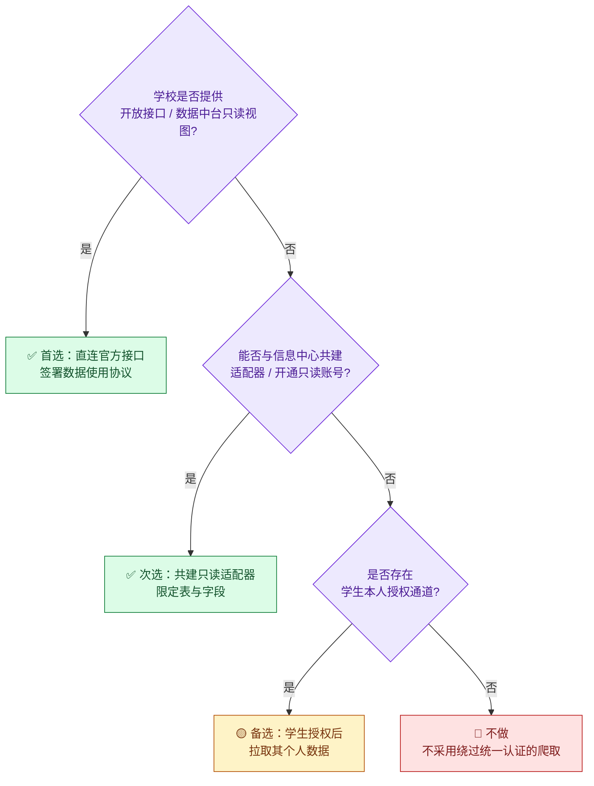
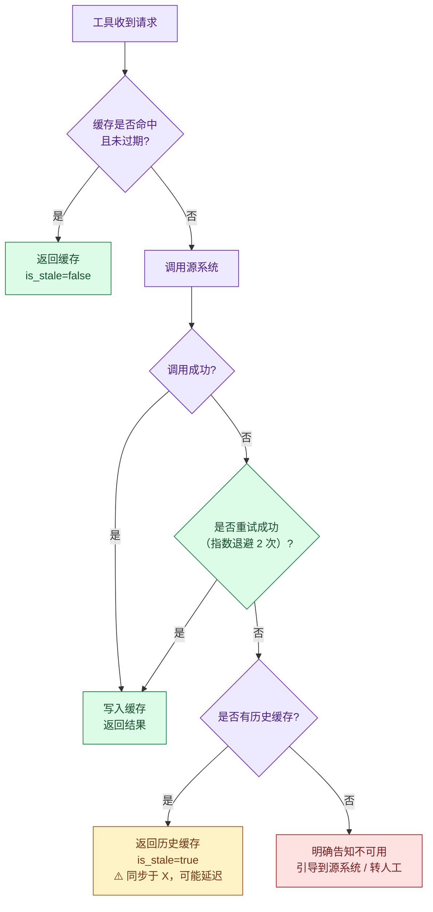
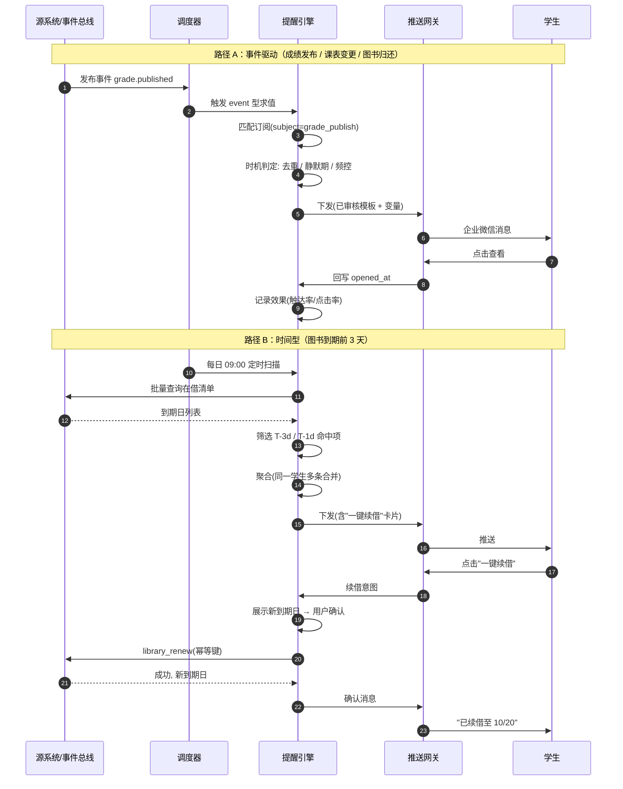

# 12 阶段一：技术架构与数据契约

> 本文回答"怎么落地"：数据从哪来、工具怎么定义、数据怎么存、失败怎么办。

---

## 1. 技术选型

| 层 | 选型 | 理由 |
|---|---|---|
| 对话接入 | 企业微信自建应用 + 微信服务号 + 小程序卡片 | 校园场景主流渠道；企微可触达辅导员侧，公众号触达学生侧 |
| 会话编排 | LLM + Function Calling（工具调用） | 四类意图边界清晰，工具调用比自由生成可控性高得多 |
| 意图路由 | 小模型分类器 + LLM 兜底 | 高频意图（四类）用轻量分类器降本提速，长尾交 LLM |
| 护栏 | 规则引擎（关键词/正则）+ 语义分类器**双通道** | 红线必须零漏拦截，单一通道不可靠 |
| 服务框架 | FastAPI（Python） | 异步、类型友好、与 Function Calling 生态契合 |
| 调度 | APScheduler / 分布式定时任务 + 事件总线 | 提醒引擎需要定时 + 事件双驱动 |
| 存储 | PostgreSQL（订阅/工单/审计）+ Redis（缓存/去重/频控） | 事务性数据与高频缓存分离 |
| 缓存 | Redis，按域设 TTL | 降低源系统压力，是第一道降级手段 |
| 观测 | OpenTelemetry + 自建看板 | 全链路 Trace 是评测的基础 |
| 部署 | 校内私有化部署（容器化） | **数据不出校**是硬要求，不用公网 SaaS |

**关键约束：数据不出校园网。** 所有 LLM 调用优先走校内私有化模型或专有通道；若必须使用外部模型，仅传"脱敏后的意图与参数"，**不传成绩明细、不传个人身份信息**。

---

## 2. 数据接入策略

### 2.1 三级接入优先级（合规前置）



> **这是本项目最重要的工程伦理约定。** 很多学生项目会直接用爬虫登录教务系统做课表 App——这在技术上可行，但**违反了《网络安全法》与学校信息系统的管理规定**，也可能因高频请求影响系统稳定性（选课期间出现过因第三方爬虫导致教务系统崩溃的案例）。**在设计文档里明确拒绝这条路径，本身就是行业理解的体现。**

### 2.2 各域适配器

| 适配器 | 数据源 | 接入方式 | TTL | 降级 |
|---|---|---|---|---|
| `EduAdapter` | 教务系统 | 官方只读视图 / 共建接口；无接口时走数据中台同步表 | 课表 15min<br/>成绩 不缓存 | 返回最近快照 + 陈旧标注 |
| `LibAdapter` | 图书馆 ILS | SIP2（借阅/续借）+ OPAC/SRU（书目） | 借阅 5min<br/>书目 1h | 返回最近快照 + 引导到馆 |
| `CardAdapter` | 一卡通 | 官方接口（阶段一仅用门禁/资产状态，不用消费明细） | 10min | 明确不可用 |
| `EventBus` | 校内事件总线 | 订阅"成绩发布""课表变更""图书归还"事件 | — | 定时轮询兜底（5min） |

**事件优先，轮询兜底：** 有事件总线时用事件驱动（秒级触达）；没有时降级为 5 分钟轮询 diff。这是"实时提醒"能否落地的关键技术选择。

---

## 3. 工具契约（Function Schema）

所有工具**单一职责、强类型、幂等**。读工具可重试，写工具必须带幂等键。

### 3.1 只读工具

```json
{
  "name": "timetable_query",
  "description": "查询学生本人的课表。仅返回调用者本人的数据。",
  "parameters": {
    "type": "object",
    "properties": {
      "student_id": { "type": "string", "description": "学号，由会话身份注入，禁止由用户输入" },
      "start_date": { "type": "string", "format": "date" },
      "end_date":   { "type": "string", "format": "date" },
      "course_name":{ "type": "string", "description": "可选，模糊匹配课程名" }
    },
    "required": ["student_id", "start_date", "end_date"]
  },
  "returns": {
    "items": {
      "course_name": "string",
      "course_code": "string",
      "teacher": "string",
      "location": "string",
      "weekday": "int",
      "period_start": "int",
      "period_end": "int",
      "weeks": "string",
      "is_changed": "bool",
      "change_note": "string|null"
    },
    "meta": { "source": "edu_system", "synced_at": "datetime", "is_stale": "bool" }
  }
}
```

```json
{
  "name": "grade_query",
  "description": "查询学生本人的已发布成绩。不得缓存明细，不得写入长期记忆。",
  "parameters": {
    "type": "object",
    "properties": {
      "student_id": { "type": "string", "description": "会话身份注入" },
      "term": { "type": "string", "description": "如 2025-2026-1，可选，缺省为最新学期" },
      "course_name": { "type": "string" },
      "aggregate": { "type": "boolean", "description": "是否返回算术汇总（均分/学分），默认 false" }
    },
    "required": ["student_id"]
  },
  "returns": {
    "items": {
      "course_name": "string",
      "credit": "number",
      "score": "number",
      "system_status": "string",
      "status_note": "string 说明：该字段为教务系统原始状态，Agent 不得自行计算"
    },
    "aggregate": { "avg_score": "number|null", "earned_credits": "number|null", "caliber": "string" },
    "meta": { "source": "edu_system", "synced_at": "datetime", "disclaimer": "成绩认定以教务处正式结论为准" }
  }
}
```

```json
{
  "name": "library_loans",
  "description": "查询学生本人的在借图书清单与可续借资格。",
  "parameters": {
    "type": "object",
    "properties": {
      "student_id": { "type": "string", "description": "会话身份注入" },
      "include_history": { "type": "boolean", "default": false }
    },
    "required": ["student_id"]
  },
  "returns": {
    "items": {
      "title": "string",
      "barcode": "string",
      "due_date": "date",
      "overdue_days": "int",
      "renewable": "bool",
      "renew_reject_reason": "string|null",
      "renew_times_left": "int",
      "fine_accrued": "number"
    },
    "meta": { "source": "library_ils", "synced_at": "datetime" }
  }
}
```

### 3.2 白名单写工具（唯一）

```json
{
  "name": "library_renew",
  "description": "续借图书。这是系统唯一的写操作白名单成员，必须满足：已向用户展示新到期日并获确认、幂等、失败不重试超过 1 次。",
  "parameters": {
    "type": "object",
    "properties": {
      "student_id": { "type": "string", "description": "会话身份注入" },
      "barcodes": { "type": "array", "items": {"type": "string"}, "maxItems": 10 },
      "idempotency_key": { "type": "string", "description": "会话ID+条码+日期 的哈希，防重复提交" }
    },
    "required": ["student_id", "barcodes", "idempotency_key"]
  },
  "preconditions": [
    "已向用户展示每条图书的新到期日并获得显式确认",
    "单次会话调用次数 ≤ 10"
  ],
  "returns": {
    "results": [{ "barcode": "string", "ok": "bool", "new_due_date": "date|null", "reason": "string|null" }]
  },
  "audit": { "level": "required", "fields": ["student_id", "barcodes", "result", "timestamp"] }
}
```

### 3.3 提醒与兜底工具

```json
{
  "name": "reminder_subscribe",
  "description": "登记/修改/取消提醒订阅。",
  "parameters": {
    "type": "object",
    "properties": {
      "student_id": { "type": "string" },
      "subject": { "enum": ["course", "library_due", "grade_publish", "exam", "signup_deadline", "reservation_arrival"] },
      "timing": { "type": "array", "items": {"type": "string"}, "description": "如 [\"T-3d\",\"T-1d\"]" },
      "channel": { "enum": ["wecom", "wechat_mp", "miniapp", "sms_fallback"] },
      "enabled": { "type": "boolean" }
    },
    "required": ["student_id", "subject", "enabled"]
  }
}
```

```json
{
  "name": "handoff_create",
  "description": "生成转人工工单。必须携带完整上下文，缺失字段视为不合格。",
  "parameters": {
    "type": "object",
    "properties": {
      "student_id": { "type": "string" },
      "session_id": { "type": "string" },
      "user_question": { "type": "string" },
      "intent_history": { "type": "array", "items": {"type": "string"} },
      "hit_rules": { "type": "array", "items": {"type": "string"} },
      "retrieved_facts": { "type": "array", "items": {"type": "object"} },
      "agent_response_log": { "type": "string", "description": "Agent 已输出的内容，避免人工重复解释" },
      "suggested_owner": { "type": "string" },
      "priority": { "enum": ["P0", "P1", "P2"] }
    },
    "required": ["student_id", "session_id", "user_question", "hit_rules", "agent_response_log", "priority"]
  }
}
```

---

## 4. 内部数据模型

```sql
-- 提醒订阅
CREATE TABLE reminder_subscription (
    id              BIGSERIAL PRIMARY KEY,
    student_id      VARCHAR(20)  NOT NULL,
    subject         VARCHAR(32)  NOT NULL,   -- course / library_due / grade_publish ...
    trigger_type    VARCHAR(16)  NOT NULL,   -- time / event / threshold
    trigger_config  JSONB        NOT NULL,   -- {"timing":["T-3d","T-1d"], "conditions":{...}}
    channel         VARCHAR(24)  NOT NULL DEFAULT 'wecom',
    priority        VARCHAR(4)   NOT NULL DEFAULT 'P2',
    enabled         BOOLEAN      NOT NULL DEFAULT TRUE,
    created_at      TIMESTAMPTZ  NOT NULL DEFAULT now(),
    updated_at      TIMESTAMPTZ  NOT NULL DEFAULT now()
);
CREATE INDEX idx_sub_student ON reminder_subscription(student_id, enabled);
CREATE INDEX idx_sub_subject ON reminder_subscription(subject, trigger_type);

-- 提醒发送记录（幂等 + 效果回流）
CREATE TABLE reminder_dispatch (
    id              BIGSERIAL PRIMARY KEY,
    subscription_id BIGINT      NOT NULL REFERENCES reminder_subscription(id),
    student_id      VARCHAR(20) NOT NULL,
    dedup_key       VARCHAR(128) NOT NULL,    -- hash(subject+trigger+date)
    dedup_date      DATE         NOT NULL,
    channel         VARCHAR(24)  NOT NULL,
    status          VARCHAR(16)  NOT NULL,    -- sent / failed / degraded / skipped_quiet
    pushed_at       TIMESTAMPTZ,
    opened_at       TIMESTAMPTZ,
    action_taken    VARCHAR(32),              -- viewed / renewed / returned / null
    is_degraded     BOOLEAN      NOT NULL DEFAULT FALSE,
    UNIQUE (dedup_key, dedup_date)            -- 数据库层保证去重
);
CREATE INDEX idx_dispatch_student ON reminder_dispatch(student_id, pushed_at DESC);

-- 转人工工单
CREATE TABLE handoff_ticket (
    id              BIGSERIAL PRIMARY KEY,
    student_id      VARCHAR(20)  NOT NULL,
    session_id      VARCHAR(64)  NOT NULL,
    user_question   TEXT         NOT NULL,
    intent_history  JSONB,
    hit_rules       JSONB        NOT NULL,
    retrieved_facts JSONB,                    -- 已查得事实（含来源与同步时间）
    agent_response_log TEXT      NOT NULL,    -- Agent 已输出内容
    suggested_owner VARCHAR(64),
    priority        VARCHAR(4)   NOT NULL,
    status          VARCHAR(16)  NOT NULL DEFAULT 'open',   -- open/handling/closed
    owner           VARCHAR(64),
    first_response_at TIMESTAMPTZ,
    closed_at       TIMESTAMPTZ,
    created_at      TIMESTAMPTZ  NOT NULL DEFAULT now()
);
CREATE INDEX idx_ticket_sla ON handoff_ticket(status, priority, created_at);

-- 审计日志（脱敏后）
CREATE TABLE audit_log (
    id          BIGSERIAL PRIMARY KEY,
    ts          TIMESTAMPTZ NOT NULL DEFAULT now(),
    student_id  VARCHAR(20),
    session_id  VARCHAR(64),
    action      VARCHAR(48)  NOT NULL,       -- tool_call / redline_block / write_exec / handoff
    tool_name   VARCHAR(48),
    args_digest JSONB,                       -- 脱敏后参数（不含成绩、身份证明文）
    result      VARCHAR(16),
    latency_ms  INT,
    channel     VARCHAR(24)
);
CREATE INDEX idx_audit_action ON audit_log(action, ts DESC);
```

**存储红线（对应 R3）：**

| 数据 | 是否落库 | 说明 |
|---|---|---|
| 课表 | ❌ 仅缓存 TTL 15min | 缓存 key 含学号，加密存储 |
| 成绩明细 | ❌ **不落任何持久化存储** | 仅当次会话内存中处理 |
| 借阅记录 | ❌ 仅缓存 TTL 5min | — |
| 提醒订阅 | ✅ | 不含成绩/借阅明细，只含"订阅了什么" |
| 发送记录与效果 | ✅ | 不含消息全文（仅状态与行为） |
| 工单 | ✅ | 文本经脱敏处理 |
| 审计日志 | ✅ | 参数摘要化，保留 ≥180 天 |

---

## 5. 缓存与降级策略



| 场景 | 策略 | 用户可见表述 |
|---|---|---|
| 缓存在有效期内 | 直接返回 | 无特殊提示 |
| 源超时，有历史缓存 | **降级返回 + 陈旧标注** | "⚠️ 数据同步于 13:40，可能不是最新，建议以教务系统为准" |
| 源超时，无缓存 | **明确不可用** | "教务系统暂时无法访问，你可以稍后重试，或直接登录教务系统查看" |
| 关键写操作（续借）失败 | **不降级、不重试超 1 次** | "续借未成功（原因：已被他人预约），可到流通台办理" |
| 源系统维护中 | 展示维护公告 | "图书馆系统今日 22:00–24:00 维护，期间数据不可用" |

> **原则：宁可说"我不知道"，也不给陈旧数据不带标注。** 校园场景下，**一个被信任错误数据的后果，远大于一次查询失败。**

---

## 6. 关键时序：提醒的完整闭环



**注意路径 B 中的"确认"步骤：** 即便是白名单写操作，也**必须**有"展示预期结果 → 用户确认"的环节。这是把"AI 能自动做"变成"用户允许 AI 做"的关键——**信任来自可预期性，不来自自动化程度。**

---

## 7. 护栏实现要点

| 层 | 实现 | 覆盖 | 要求 |
|---|---|---|---|
| L1 关键词/正则 | 规则引擎（YAML 配置，可热更新） | 明确红线词（毕业、学籍、自杀…） | 零漏拦截（针对显式词） |
| L2 语义分类器 | 微调 / Few-shot 分类模型 | 隐晦表达（"我不想活了但我说的是别的"、"我这情况还能顺利走吗"） | 召回率 ≥ 99% |
| L3 输出侧审核 | 生成后扫描 | 禁止出现的表述（判定性、排名、他人信息） | 命中即拦截并替换为兜底话术 |
| L4 工具侧权限 | 工具入参 `student_id` **只能由会话注入，不可由用户或模型指定** | 越权查询 | 硬编码约束，不可被提示词绕过 |
| L5 写操作确认 | 状态机强制要求确认态 | 静默写 | 无确认态则不执行 |

> **L4 是本设计中最容易被忽略但最关键的一条：** 让 `student_id` 由**会话身份层直接注入**，而不是作为模型可填的参数，可以从架构上**根本性杜绝"提示词注入导致越权查他人成绩"**。安全不应依赖模型的自觉。

---

## 8. 非功能需求

| 类别 | 要求 |
|---|---|
| 性能 | 只读查询 P95 < 2s；缓存命中 P95 < 300ms；提醒下发 P95 < 5s |
| 可用性 | 服务可用性 ≥ 99.5%；单源故障不影响其他能力 |
| 容量 | 2 万在校生；提醒峰值（开学/期末）日推送量 ≤ 6 万条 |
| 数据时效 | 课表 ≤ 15min；借阅 ≤ 5min；事件型提醒 ≤ 10min |
| 安全 | 全链路 TLS；数据库字段级加密（学号、姓名）；`student_id` 会话注入 |
| 合规 | 数据不出校园网；日志脱敏；审计留存 ≥ 180 天；提供个人数据导出与删除入口 |
| 可维护 | 红线规则、提醒模板、SLA 配置**均通过配置下发，不发版即可调整** |

---

**相关文档** → [10 阶段一主设计](./10-阶段一-校园助手Agent设计.md) ｜ [11 边界矩阵](./11-阶段一-AI可执行与人工兜底边界矩阵.md) ｜ [13 风控合规与评测上线](./13-阶段一-风控合规与评测上线.md)
