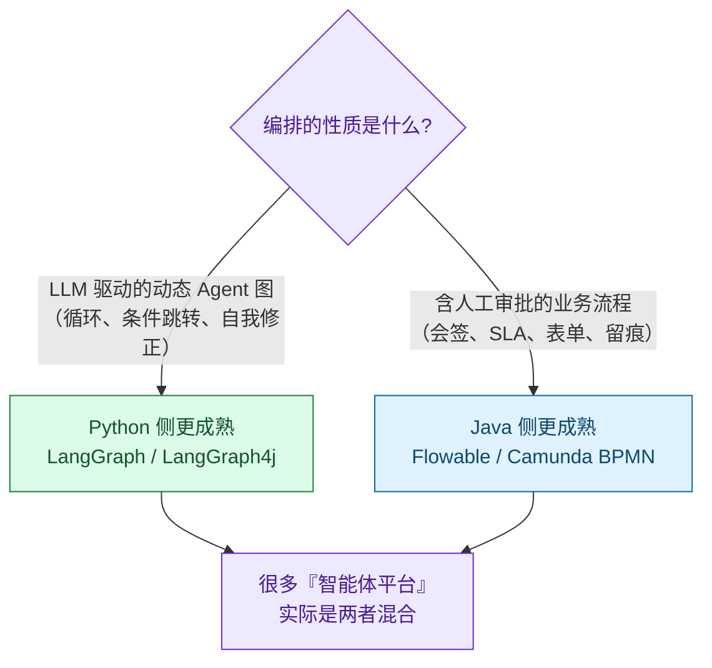
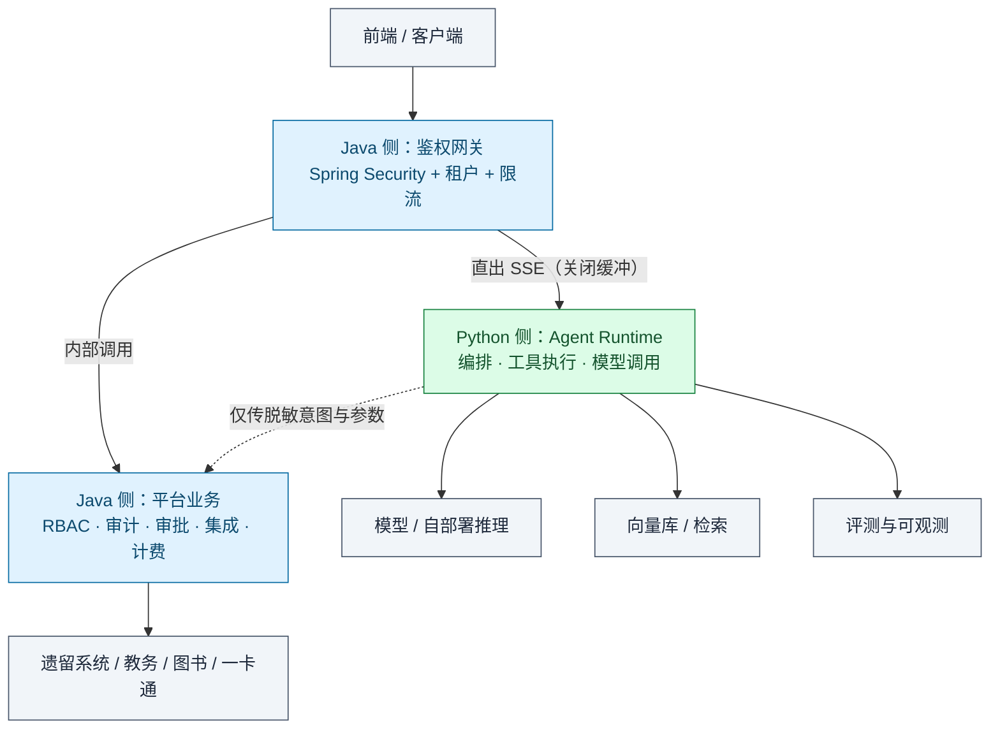

# 14 技术选型：Agent Web 平台后端框架对比（Spring Boot vs FastAPI）

> 本文回答一个问题：**做智能体 Web 平台，后端该选 Spring Boot 还是 FastAPI？**
> 结论不是"谁更好"，而是"**你的约束条件把答案锁死在哪一边**"。文末给出明确推荐。

---

## 0. 结论先行

### 0.1 三条决策规则

| 规则 | 条件 | 选择 |
|---|---|---|
| **规则一** | 平台要长期长在 **Java 主导的 IT 体系**里（企业内部平台、高校信息中心、政务/国企） | **Spring Boot（Spring AI）为主体** |
| **规则二** | 智能体能力是**产品核心**，从零快速迭代，需要**自部署模型 / 检索 / 评测** | **FastAPI 为主体** |
| **规则三** | 两边都有硬需求 | **混合**，但必须一刀切清边界（见 §4） |

### 0.2 一句话结论

> **2026 年，"Java 做不了 Agent"已经不成立了。** Java 侧生态从"能跑通 Demo"进化为"工程可用"：Spring AI 1.0 于 2025-05 GA、1.1 于 2025-11 GA（内置 MCP），2.0 已发布并基于 Spring Boot 4；官方 MCP Java SDK 由 Spring AI 参与共建；LangChain4j 已到 1.10.x；LangGraph4j 补齐了 Agent 图编排（环、检查点、时间旅行调试）；Embabel、Google ADK Java、Semantic Kernel、Quarkus/Helidon 的 MCP 扩展均已就位。
>
> **因此选型的天平不再由"AI 生态"决定，而由"团队与组织的既有约束"决定。**
>
> - 无历史包袱 → **FastAPI**
> - 有 Java 体系约束（国内企业/高校场景大概率成立）→ **Spring Boot**

### 0.3 关键判断表（快速版）

| 你的处境 | 推荐 |
|---|---|
| 3-5 人小团队，从零做 AI 产品，要在 1-3 个月内跑出可用版本 | **FastAPI** |
| 需要自部署模型（vLLM/SGLang）、自建 embedding/重排/评测流水线 | **FastAPI**（无替代方案） |
| 交付给已有的 Java 中台团队，要接遗留系统、过等保、走既有发布流程 | **Spring Boot** |
| 平台重度依赖 RBAC、多租户、审批流、审计、对账 | **Spring Boot** |
| 平台既要做 Agent 内核，又要做企业门户 | **混合**（§4） |
| 两人以下、只做 Demo / 简历项目 | **FastAPI**（不要为了"企业感"背上双栈成本） |

---

## 1. 维度一：开发效率

### 1.1 对比

| 项 | FastAPI | Spring Boot |
|---|---|---|
| 核心语言范式 | 动态类型 + Pydantic v2 运行时校验 | 静态类型 + 编译期检查 |
| 工具定义成本 | **极低**：Pydantic Model → JSON Schema 自动生成，函数签名即契约 | **低**：`@Tool` / `@McpTool` 注解 + 自动 schema 生成（Spring AI） |
| 编排迭代速度 | **快**：prompt、链路、工具调整都是改代码即生效，无需重启 | 中：需重启，Spring Boot 4 的 DevTools 已改善 |
| 最小闭环代码量 | 工具调用 + 流式 + 多轮记忆 ≈ 100 行 | ≈ 80-150 行（注解化后差距不大） |
| **复杂编排的差距** | 子 Agent、条件分支、重试回退、人工介入节点 → LangGraph 已高度封装 | LangGraph4j 可用但生态文档较少，部分能力需自研 |
| 脚手架空转 | 无，起步即业务 | 有：配置、分层、Bean 装配需一定前期投入 |

### 1.2 结论

- **前 3 个月**：FastAPI 快 **2-3 倍**。差距主要来自"改完即生效"的迭代手感与 Python 侧的参考实现密度。
- **12 个月后**：差距**显著收敛**。若团队是 Java 背景，Spring Boot 反而更省——因为省下的是"重新建立交付体系"的成本。
- **真正的分水岭**：编排复杂度。简单"单 Agent + 若干工具"两边都很轻松；一旦出现**多 Agent 协作 + 人工审批节点 + 长事务 + 回退重试**，Java 侧的传统工作流引擎（Flowable/Camunda）反而更成熟，而 LLM 驱动的动态图编排 LangGraph 更成熟。**这不是效率差距，是范式差异。**

---

## 2. 维度二：并发与性能

### 2.1 先定性质：Agent 负载是什么？

**这是最容易被误判的一点。** Agent 平台的核心负载**不是 CPU 密集，而是 I/O 密集 + 长连接持有**：

```
一次典型 Agent 请求的时间构成
├─ 等模型返回首个 token：1-5 秒   ← I/O 等待（占绝对大头）
├─ 流式输出：5-60 秒             ← 长连接持有
├─ 工具调用往返：0.1-3 秒 × N     ← I/O 等待
└─ 本机 CPU 计算：< 5%            ← 几乎可忽略
```

**所以吞吐量的决定因素是"单机能同时挂住多少条活跃连接"，而不是"CPU 跑得多快"。**

### 2.2 对比

| 项 | FastAPI（ASGI / uvicorn） | Spring Boot |
|---|---|---|
| 默认并发模型 | 单事件循环 + asyncio 协程 | Servlet 线程池（Tomcat 默认 200 线程） |
| 长连接（SSE）单机容量 | **数千至上万**并发连接，内存占用低 | **数百**级（每连接占一线程），内存较重 |
| 高并发替代方案 | 多 worker 进程 + 多实例 | **WebFlux 响应式**（高并发但心智负担大、调试难）<br/>**JDK 21+ 虚拟线程**（线程式模型 + 近异步扩展性） |
| 关键风险 | ⚠️ **一个同步阻塞调用会卡死整个事件循环**（同步 DB 驱动、同步 HTTP 客户端、大 JSON 解析、token 计数） | ⚠️ 线程池耗尽后请求排队；默认配置下 SSE 场景容易触顶 |
| 纯业务 API 的 QPS / 尾延迟 | 中 | **更优**（JIT 预热后表现好，延迟方差更小） |

> **2026 年的关键变量：JDK 21+ 虚拟线程。** 它让 Java 用"每请求一线程"的直白写法获得接近异步的扩展性，**基本抹平了长连接场景的并发差距**。这是过去两年这个对比里最大的变化——如果还在用"Java 扛不住几万长连接"作为选型理由，那是基于 JDK 8/17 时代的旧认知。（有资料称 Java 在持续负载下延迟方差比 Python 低 20-35%，该口径来自第三方评测，建议以自测为准。）

### 2.3 两边都适用的三条硬规则

1. **CPU 密集任务不要放进 Web 进程。** embedding、重排、文档解析、大规模 token 计算 → 一律拆成独立服务（这正是混合架构最常见的正当理由）。
2. **分钟级以上的长任务不要用 HTTP 长连接扛。** 用消息队列 + 任务状态查询/订阅。
3. **流式链路避免二次缓冲。** 任何中间层（Nginx、Java 网关）开启响应缓冲都会把 token 流"攒成一坨"，破坏流式体感。

### 2.4 结论

- 长连接 / 流式场景：**FastAPI 默认占优**；Java 21 虚拟线程后**接近持平**。
- 高 QPS 业务 API：**Spring Boot 更优**。
- 若必须用 Servlet 模型又不想上 WebFlux：**务必显式配置虚拟线程**，否则 SSE 并发会成为瓶颈。

---

## 3. 维度三：生态与可扩展性

### 3.1 两边的护城河

| | FastAPI / Python 强在 | Spring Boot / Java 强在 |
|---|---|---|
| AI 侧 | 模型 SDK **首发**；MCP server 生态（多为 Python/TS）；向量库与检索客户端；**评测框架**（Ragas、DeepEval）；**可观测**（Langfuse、OTel GenAI 语义约定的 Python SDK 最全）；**自部署推理**（vLLM、SGLang） | Spring AI 2.0（ChatClient/Advisors/`@McpTool`）、LangChain4j 1.10.x、LangGraph4j、Embabel、Google ADK Java、Semantic Kernel；**官方 MCP Java SDK**（与 Spring AI 共建） |
| 企业侧 | 需自行堆砌 | **碾压**：Spring Security（RBAC/SSO/OAuth2）、Spring Batch、Spring Integration、**事务与一致性**、Flowable/Camunda（BPMN 人工审批/会签/SLA）、Kafka/Nacos/Seata、成熟 JDBC 生态 |
| 组织侧 | AI 人才供给以 Python 为主 | **国内高校与政企遗留系统绝大多数是 Java**，交接阻力最小 |

### 3.2 编排的分野（这一点决定架构走向）



> **常见误区：** 把"业务流程审批"和"Agent 自主决策"当成同一件事。前者是**确定性的**（有明确节点与责任人），后者是**概率性的**（模型自己决定下一步）。用 BPMN 引擎去做 Agent 自主决策会很别扭；用 LLM 去驱动必须留痕、必须会签的审批流则是灾难。**识别清楚你的平台里这两种编排各占多少比例，选型就有答案了。**

### 3.3 结论

- **AI 生态：FastAPI 领先，但领先幅度已收窄**至"新特性落地时差约半年"，不再是鸿沟。
- **企业生态：Spring Boot 领先，且这个优势不会缩小**（是二十年积累）。
- **可扩展性的真正含义**：不是"能不能加功能"，而是"**加了之后谁会维护**"。选一个团队不熟悉但生态更好的栈，是可扩展性的负分。

---

## 4. 维度四：与 AI / 大模型库的集成难易度

### 4.1 现状对比

| 项 | FastAPI | Spring Boot |
|---|---|---|
| 模型供应商 SDK | **全部首发**，包括国内厂商 | 通过 Spring AI / LangChain4j 适配，主流厂商覆盖良好 |
| 新模型新特性（结构化输出模式、prompt caching、`reasoning_content`、多模态 part） | 第一时间可用 | **常需手工处理或等框架适配**，存在数月时差 |
| 工具调用 schema | Pydantic 自动生成，最省心 | `@Tool` / `@McpTool` 注解自动生成，**已达到同等便利度** |
| 类型安全 | 运行时校验 | **编译期校验** —— 工具入参/出参类型错误在编译期暴露，对**工具密集的平台是实打实的收益** |
| MCP 支持 | 官方 Python SDK，server 生态最丰富 | 官方 Java SDK + Spring AI Boot Starter；`@McpTool` 注解 + YAML 配置自动加载；Streamable HTTP / SSE / stdio 全支持 |
| 自部署模型、embedding、重排、评测 | **唯一现实选择** | 不适合，交给 Python sidecar |
| 流式增量解析（tool_call delta 拼接） | 库已封装 | 部分场景需手工处理 |

### 4.2 结论

**FastAPI 仍占优，但优势已从"决定性"降为"有意义的偏好"。**

- 如果你的平台**重度依赖最新模型特性**（比如刚发布的推理模式、缓存机制、多模态能力），Python 的响应速度快一个季度。
- 如果你的平台**工具数量多、接口契约重**，Java 的编译期类型校验能提前拦掉一类线上问题——**这是被低估的真实收益**。
- **只要涉及自部署推理或自建检索/评测流水线，Python 就是必选项**，此时 Java 只能是外围。

---

## 5. 维度五：团队技术栈与学习成本

### 5.1 双向成本都要算清

| 迁移方向 | 显性成本 | **隐性成本（最易低估）** |
|---|---|---|
| Java 团队 → FastAPI | Python 语言本身，学习曲线平缓 | **交付运维体系需要重建**：CI/CD、监控告警、日志采集、灰度发布、安全扫描、值班机制。这套东西在 Java 侧已成熟，Python 侧要重搭一遍 |
| Python 团队 → Spring Boot | Spring 心智模型（IoC/AOP/事务）、Spring AI 注解、并发模型 | 需重新适应"编译-打包-发布"的节奏；框架升级涉及大版本迁移 |

### 5.2 招聘与交接

- **招聘**：AI 工程师以 Python 为主；企业平台工程师以 Java 为主。
- **交接（关键）**：如果是**校内/企业内部项目，最终要交给信息技术部门维护**，那么技术选型的决定性因素往往是"**接手方会不会维护**"。一个技术上更优的 Python 服务，交到 Java 团队手里，很可能**上线即孤儿**——这比性能差 30% 严重得多。

### 5.3 结论

**团队熟悉度 > 框架优越性。**

> 一个用 Spring AI 写出的、团队能持续维护的 Agent 平台，长期价值高于一个用 LangGraph 写出但没人敢改的"更先进"的系统。

---

## 6. 维度六：长期维护成本

| 项 | FastAPI | Spring Boot |
|---|---|---|
| 依赖链稳定性 | **差**：AI 库变动剧烈（LangChain 式破坏性升级是前车之鉴），Pydantic v1→v2 这类迁移成本高 | **中**：框架本身稳定、向后兼容好；但 Spring Boot 3→4 是大版本迁移 |
| 重构安全性 | 弱类型 → 大团队重构有风险 | **强**：类型系统 + IDE 支持让大规模重构可控 |
| 运行内存 | 低（单进程几十 MB） | 高（JVM 数百 MB 起） |
| 镜像体积 | 大（含 torch/transformers 时数 GB） | 小（几百 MB） |
| 框架寿命 | 中（AI 框架更替快） | **长**（Spring 有商业支持承诺） |
| Python 3.13+ 自由线程 | 逐步缓解 GIL 限制 | — |

### 6.1 两边共同的最大风险

**模型与厂商 SDK 每月都在变。** 无论选谁，都必须做到：

> **把模型调用收敛到一层薄适配。** 业务代码只依赖内部定义的统一接口（`ChatModel` / `Embeddings` 抽象），厂商差异隔离在适配器内。

否则换一次模型 = 一次全量重构。这条比选 Java 还是 Python 重要得多。

### 6.2 结论

**短期（< 1 年）FastAPI 维护成本低；长期（> 2 年）Spring Boot 成本低。** 分界线在于团队规模与人员流动率——**人越多、流动越快，类型系统与框架稳定性带来的收益越大。**

---

## 7. 智能体平台典型场景映射

| 场景 | FastAPI | Spring Boot | 谁更合适 |
|---|---|---|---|
| **多轮对话 / 会话记忆** | Pydantic 状态模型 + 丰富的记忆持久化方案 | Spring AI `MessageChatMemoryAdvisor` + `ChatMemory`，与 Redis/事务集成自然 | **平手**。Java 侧因与既有存储/事务体系贴合，企业场景实际更省事 |
| **任务编排** | **LLM 驱动图**：LangGraph 的循环、检查点、人工介入、时间旅行调试最成熟 | **业务流程**：Flowable/Camunda BPMN 的会签、SLA、人工审批最成熟；LangGraph4j 已补齐 Agent 图能力 | **看编排性质**（见 §3.2） |
| **流式响应** | `StreamingResponse` + async，代码最短，SSE 原生贴合 | `SseEmitter`（虚拟线程友好）/ WebFlux `Flux<ServerSentEvent>`；异步链路更绕 | **FastAPI 略优**；Java 侧需注意网关缓冲与线程配置 |
| **工具调用 / Function Calling** | Pydantic → JSON Schema，零心智负担 | `@Tool` 注解 + 自动 schema，**已达到同等便利** | **平手**（Java 侧另有编译期类型安全的附加收益） |
| **MCP（工具生态）** | 官方 Python SDK，**server 生态最丰富**，第三方 MCP 工具多为 Python/TS | 官方 Java SDK + `@McpTool` 注解 + YAML 自动装配，server/client 双向支持 | **FastAPI 略优**（生态广度）；**Java 侧注解化体验更好** |
| **超长任务（分钟~小时级）** | 都不该用 HTTP 扛 → 消息队列 + 状态查询 | 同左；Java 侧队列/调度生态更成熟 | **Spring Boot** |
| **企业集成（权限/审计/审批/对账）** | 需自建 | Spring Security / 事务 / Batch / 审计 | **Spring Boot 碾压** |
| **自部署模型 / 检索 / 评测** | vLLM、SGLang、RAGAS、Langfuse | 不适合 | **FastAPI 唯一选择** |

---

## 8. 推荐架构

### 8.1 方案 A：纯 FastAPI（推荐给"无历史包袱的产品团队"）

```
前端 / 客户端
    ↓ HTTPS + SSE
FastAPI（API 网关 + Agent Runtime 合一）
    ├─ 身份：自建 JWT/OAuth2（或接 Keycloak/Authing）
    ├─ Agent：LangGraph 编排 + Pydantic 工具定义
    ├─ 模型：LiteLLM / 各家 SDK，统一薄适配层
    ├─ 检索：向量库 + 重排
    ├─ 状态：Redis（会话）+ PostgreSQL（平台数据）
    └─ 长任务：Celery / Arq + 消息队列
    ↓
自部署推理（vLLM）或外部模型 API
```

**适用**：团队 ≤ 10 人、AI 是核心价值、无重企业集成、可接受自建权限体系。

### 8.2 方案 B：纯 Spring Boot + Spring AI（推荐给"要长在 Java 体系里的平台"）

```
前端 / 客户端
    ↓ SSE
Spring Boot 4 + Spring AI 2.0
    ├─ 身份：Spring Security + OAuth2（对接既有 SSO/LDAP）
    ├─ Agent：ChatClient + Advisors + `@Tool` / `@McpTool`
    ├─ 编排：LangGraph4j（Agent 图）+ Flowable（人工审批流）
    ├─ 模型：Spring AI 多模型抽象（20+ 供应商）
    ├─ 观测：Micrometer + Actuator（token 用量、延迟、错误率开箱可用）
    └─ 并发：JDK 21+ 虚拟线程（必须显式开启）
    ↓
既有 Java 中台 / 遗留系统 / 消息队列
```

**适用**：企业/高校/政务内部平台，需接遗留系统、过等保、走既有发布流程、由 Java 团队长期维护。

### 8.3 方案 C：混合（只在两边都有硬需求时采用）



**边界划分（必须绝对清晰，否则混合架构必崩）：**

| 归属 | Java（Spring Boot） | Python（FastAPI） |
|---|---|---|
| 负责 | 身份、租户、RBAC、审计、审批流、计费、遗留系统集成、对外网关 | prompt 与编排、工具执行、模型调用、流式 token、检索、评测 |
| **不负责** | ❌ 不碰 prompt、不碰模型调用 | ❌ **不做权限校验、不直连业务库**（权限由 Java 侧传入的上下文决定） |

**三条混合架构的硬规则：**

1. **业务真源只有一个。** 一旦出现"Python 也校验一遍权限"，边界即崩塌，后续必然出现"两边逻辑不一致"的线上事故。
2. **流式不要让 Java 层做缓冲代理。** 由 Python 直出 SSE，Java 侧仅做鉴权反代并关闭缓冲，否则 token 流会被攒成一块。
3. **Python 侧只接收"已鉴权的最小上下文"**（如租户 ID + 用户标识 + 权限范围），不接收原始凭证。

---

## 9. 风险与反模式清单

| # | 反模式 / 风险 | 说明 | 对策 |
|---|---|---|---|
| 1 | **混合架构两边都实现业务逻辑** | 最常见的失败模式，短期看是"冗余保险"，长期是"不一致的根源" | 严格执行 §8.3 的边界表，Code Review 时把越界视为阻断项 |
| 2 | **MCP 暴露面无认证** | MCP 规范**默认不要求认证与授权**（CSA 2026-05 的研究指出该缺口）；一旦把 `@McpTool` 暴露为 HTTP 端点，任何能触达该端点的客户端都能诱导模型调用你的业务逻辑 | 必须：OAuth2/API Key + **工具白名单** + 调用审计 + 网络层隔离（不得公网直出） |
| 3 | **在 Web 进程里做 CPU 密集计算** | Python 侧会卡死事件循环，Java 侧会耗尽线程池 | embedding/重排/解析拆独立服务 |
| 4 | **用 HTTP 长连接扛长任务** | 连接数被任务时长拖死 | 队列 + 状态查询/订阅 |
| 5 | **模型调用未收敛到适配层** | 换模型 = 全量重构 | 统一 `ChatModel` 抽象，厂商差异隔离在适配器内 |
| 6 | **为了"企业感"强行上双栈** | 小团队同时维护两套交付体系，是纯粹的净损失 | 明确：**混合架构是成本，不是能力**。没有硬需求就不要混合 |
| 7 | **用 BPMN 做 Agent 自主决策 / 用 LLM 驱动必须留痕的审批** | 范式错配 | 见 §3.2 的分野 |
| 8 | **默认线程模型直接上 SSE** | Servlet 默认 200 线程，长连接场景迅速触顶 | 开启 JDK 21+ 虚拟线程，或改 WebFlux |

---

## 10. 针对本项目的落地建议

本项目（校园智能体（湖南理工大学））属于典型的"**要长在既有 IT 体系里**"的场景，因此：

| 判断依据 | 结论指向 |
|---|---|
| 最终需交付现代教育技术中心（信息化部门）长期维护 | 接手方的技术栈是第一约束 |
| 需对接教务系统、图书馆 ILS、一卡通等遗留系统 | Java 侧集成生态更顺 |
| 需通过等保、留存审计、涉及学生敏感信息 | Spring Security + 审计链路成熟 |
| 系统生命周期远长于在校时间 | 必须有"可交接性" |
| 阶段一无需自部署模型、无需复杂检索/评测 | **暂时不需要 Python sidecar** |

**推荐：方案 B（Spring Boot + Spring AI 为主）**，理由：

1. **决定因素不是性能，是可交接性。** 学生项目最大的失败不是技术选型不先进，而是毕业后无人能改。
2. **2026 年 Java 侧能力已足够支撑阶段一的全部需求**：`@Tool` 注解化工具调用、ChatMemory 多轮记忆、`SseEmitter` + 虚拟线程做流式、Micrometer 开箱可用的 token 用量与延迟观测。
3. **阶段一的四类能力（课表、成绩、借阅查询、到期提醒）本质是"业务 API 编排 + 轻量 Agent 对话"**，重心在企业集成而非模型创新，Java 侧的强项正好命中。
4. **后续阶段仍需保持边界**：若阶段三要做学业规划的检索增强、或计划自部署模型，再引入 Python sidecar 承担"检索 + 评测"职责，按 §8.3 的边界表执行。

**若团队为纯 Python 背景且明确不接受 Java**：则选方案 A，但必须在设计文档中显式记录"接手成本"这一已知风险，并提前准备运维交接材料（部署脚本、监控项清单、故障手册）。

---

**相关文档** → [10 阶段一主设计](./10-阶段一-校园助手Agent设计.md) ｜ [12 技术架构与数据契约](./12-技术架构与数据契约.md) ｜ [13 风控合规与评测上线](./13-阶段一-风控合规与评测上线.md)
